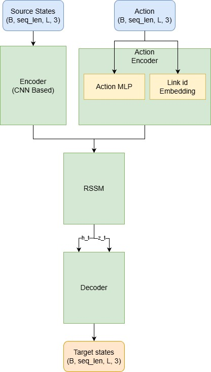

# Modelagem da Manipulação de Objetos Lineares Deformáveis
# Modeling the Manipulation of Deformable Linear Objects

## Presentation

This project originated in the context of the graduate course *IA376N - Generative AI: from models to multimodal applications*, 
offered in the second semester of 2025, at Unicamp, under the supervision of Prof. Dr. Paula Dornhofer Paro Costa, from the Department of Computer and Automation Engineering (DCA) of the School of Electrical and Computer Engineering (FEEC).

> | Name | RA | Specialization |
> |--|--|--|
> | Tim Missal | 298836 | Computer Science |
> | Lucas Vinícius Domingues | 291414 | Computer Science |
> | Natália da Silva Guimarães | 298997 | Engineering |

## Abstract

This project aims to develop a **probabilistic dynamics model** for **Deformable Linear Objects (DLOs)**, which is fundamental for autonomous manipulation with risk awareness. We generated a synthetic dataset of 1 million transitions (**state, action, next state**) using the **MuJoCo** simulator. Architectures such as **BiLSTM**, **BERT**, **Transformer**, **Diffusion-Models** and **Dreamer** were evaluated to predict the rope's future configuration. The best performance was shown by the **Dreamer** model.

---

## 1.Problem Description / Motivation

The autonomous manipulation of Deformable Linear Objects (**DLOs**), such as cables and ropes, is a significant challenge due to ambiguity in perception (like overlaps) and **unpredictable action outcomes** caused by high friction in entangled states.

Classical methods fail to **quantify this uncertainty**, opting for actions that maximize immediate gain but may lead to high-risk states in the long term. The central motivation of this project is to develop a **model** that predicts a **probability distribution** over future states, allowing the agent to make decisions that **minimize risk** over an extended time horizon, rather than simply pursuing instantaneous reward.

## 2.Objectives

Develop a **dynamics model** capable of predicting the future state and **quantifying the uncertainty** of a Deformable Linear Object (**DLO**), given its current configuration and an applied action.

## 3. Methodology

### 3.1 Overview

The project aims to develop a model capable of predicting the future state of a **Deformable Linear Object (DLO)** given its current configuration and an applied action. This predictive model serves as the foundation for future development of **risk-aware agents** for autonomous DLO manipulation. Our workflow for our most successful model, the **Dreamer**, is described in the following picture. Workflows for other models can be found in the attached presentation. 



### 3.2 Dataset Generation

To train and evaluate the proposed models, a synthetic dataset of **(state, action, next_state)** tuples was generated using the **MuJoCo physics engine** (Multi-Joint dynamics with Contact). MuJoCo is a widely used simulation framework for robotics and deformable object modeling due to its accurate contact and joint dynamics.

#### Simulation Setup

- The rope was modeled as a chain of **70 connected cylinders** linked through ball joints, simulating a flexible, deformable body.  
- **State representation ($\mathbf{s}_{t}$):** The 3D coordinates $(\mathbf{x}, \mathbf{y}, \mathbf{z})$ of the rope’s 70 cylinders.  
- **Action representation ($\mathbf{a}_{t}$):** A 3D force vector applied to a single cylinder at each step.  
- **Next state ($\mathbf{s}_{t+1}$):** Rope configuration after the force is applied.  

### 3.3 Modeling Approaches

Three model architectures were evaluated to learn the rope dynamics:

#### (a) BiLSTM

- Based on the model proposed by Yan et al. (2019) [2], which demonstrated strong results for state estimation in DLO manipulation.  
- The **Bidirectional LSTM** captures both forward and backward dependencies between rope links, essential since each link’s motion depends on its neighbors on both sides.  
- **Residual connections** were added to allow the model to predict position deltas, improving stability and convergence.

#### (b) BERT

 - The **Rope BERT** model uses a **Transformer Encoder-only** architecture, adapted from the original BERT (Bidirectional Encoder Representations from Transformers) design.
 - It utilizes the **bidirectional** nature of the Transformer Encoder to process the rope's state sequence (the 70 link points) by allowing each point's prediction to be informed by all other points, regardless of their position (before or after) in the sequence
 - It predicts the **position delta** (change in position) to derive the next state.

#### (c) Transformer

- This model, **Rope Transformer** , was primarily configured as a **Decoder-only** network for sequence-to-sequence prediction.
- In this setup, the decoder takes the current rope state and action as input to autoregressively predict the next state configuration.
- The structure allows for the optional inclusion of a BiLSTM layer after the decoder to further capture temporal dependencies before predicting the final state delta.

#### (d) Diffusion

- The **Rope Diffusion** model utilizes a **Conditional 1D U-Net** architecture, specifically adapted to treat the rope's links as a spatial sequence.
- It operates as a **Denoising Diffusion Probabilistic Model (DDPM)**. Instead of directly predicting the next state coordinates in a single forward pass, the model learns to iteratively reverse a diffusion process, starting from pure Gaussian noise and refining it step-by-step into the next state configuration.
- The generation process is explicitly **conditioned** on the current rope state and the action vector via feature concatenation and time embeddings, ensuring the denoising trajectory is physically grounded.

#### (e) Dreamer (World Model)

The **Dreamer** model, a state-of-the-art **World Model** architecture, was employed to solve the supervised prediction problem. Instead of optimizing on the high-dimensional 3D coordinates, this approach learns the transition dynamics in a **compact, meaningful latent space**.

This method is crucial because it allows the model to:
1.  **Isolate Dynamics:** Focus on learning the intrinsic rope movement patterns (dynamics) rather than trivial spatial translations.
2.  **Model Uncertainty:** Map the inherent stochasticity of DLO manipulation to a **probability distribution** over future states, directly satisfying the project's goal of quantifying risk.

### 3.4 Dreamer World Model Architecture Details

The Dreamer architecture is built around the **Recurrent State-Space Model (RSSM)**, which is designed to handle both deterministic motion and inherent stochasticity by splitting the internal state into two components:

* **Deterministic Memory ($\mathbf{h}_{t}$ - LSTM Cell):** This component maintains the **long-term memory** of the trajectory, capturing sequential dependencies like velocity and momentum, which are vital for predicting motion over multiple time steps.
* **Stochastic State ($\mathbf{z}_{t}$ - Normal Distribution):** This component explicitly models **prediction uncertainty**. During training, the model learns to match the predicted state (the **Prior**) with the observed state (the **Posterior**), forcing the network to generate valid probability distributions for the future DLO configuration.

#### Physics-Informed Loss Function
The model's ability to generate physically realistic predictions is enhanced by augmenting the reconstruction loss ($L_{recon}$) with terms that enforce physical realism:

* **Kinematic Accuracy:** Matches both Position and Velocity.
* **Material Constraints:** Penalizes Stretching and unnatural Bending (enforcing inextensibility and stiffness).
* **Topological Consistency:** Includes terms to prevent Self-Intersection.
* **KL Divergence:** A regularization term ensuring the predicted dynamics (Prior) do not diverge from the observed dynamics (Posterior).

#### Training Setup

- **1.000.000 samples** used 
- Models trained for **50 epochs**  
- Checkpointing based on **validation loss (MSE)**  
- Data **normalized** using the individual center of mass (CoM) of datapoints

## 4. Evaluation Methodology

### 4.1 Metrics

Model performance was evaluated using:

- **Mean Squared Error (MSE):** Quantifies the average Euclidean distance between predicted and ground-truth rope coordinates.

  $\text{MSE}(y, \hat{y}) = \frac{1}{N} \sum_{i=0}^{N - 1}(y_i - \hat{y}_i)^2$

  where *N* is the number of rope links, $Y_i$ is the actual position of the rope link, and $\hat{Y}_i$ is the predicted position. A lower MSE indicates a better fit of the model to the data.

- **MSE on Autoregression:** Quantifies how much the predicted values differ from the ground-truth over 1000 steps

- **Qualitative Visualization:** Predicted and true rope shapes were visualized to assess spatial similarity and clustering tendencies.


### 4.2 Assessment Criteria

The objectives are considered met when:

1. The model accurately predicts next-state configurations (**low MSE/ADE**).  
2. The model generalizes to unseen actions and configurations.  

## 5. Experiments, Results, and Discussion

### 5.1 Experimental Setup

A dataset of approximately 1.000.000 samples was generated in **MuJoCo**, simulating a rope composed of 70 interconnected cylindrical segments with ball joints. Each sample consisted of a state $s_{t}$ (the 3D positions of all rope segments), an action $a_{t}$ (a force vector applied to a specific segment), and the resulting next state $s_{t+1}$.  
The dataset was normalized using a Center-of-Mass approach and divided into training, validation, and test sets. All models were trained using the **Physics Informed Loss** (Source?) loss and evaluated using **Mean Squared Error** (MSE)


### 5.2 Results

The tested model families and the corresponding results were the following: 

| Model | Params | MSE |
|--------|-----|
| BiLSTM  | 1.12M |  1.43 |
| BERT  | 1.9M |  1.43 |
| Transformer  | 407K |  1.45 |
| Diffusion  | 700K |  1.69 |
| Dreamer  | 11M |  1.16 |


Visual inspection of predicted centerlines revealed that the BiLSTM, BERT and Transformer failed to predict the rope states accurately. Instead, these models produced rope states which were clustered near the rope positions. In contrast, Dreamer seemed to follow the general structure of the rope rather accurately.

### 5.3 Discussion of Results

#### Superiority of World Models
The **Dreamer Rope Model** demonstrated a significant improvement, achieving an MSE of $\mathbf{1.16}$ and capturing rope dynamics with superior efficiency compared to baseline models (BiLSTM, BERT, Transformer). This success is attributed to its **World Model** approach, which:
1.  **Considers Temporal Sequences:** Explicitly models long-term dependencies through the Recurrent State-Space Model (**RSSM**), crucial for predicting complex, multi-step manipulation outcomes.
2.  **Utilizes a Compact Latent Space:** Learns transition dynamics in a **dense, meaningful latent space**, allowing for efficient feature representation.
3.  **Models Uncertainty:** Manages the inherent stochasticity of DLO manipulation by mapping states to **probability distributions** (via the stochastic state $\mathbf{z}_{t}$).

#### Importance of Temporal Dynamics
The clustering of MSE results for the BiLSTM, BERT, and Transformer models (all $\approx 1.43-1.45$) confirms that methods which fail to adequately capture temporal dynamics across multiple steps struggle to generalize. These models perform poorly in **long-horizon autoregressive scenarios** (simulating long rollouts), as errors compound quickly when relying solely on instantaneous predictions. The Dreamer model's architecture successfully mitigates this limitation by leveraging its recurrent memory ($\mathbf{h}_{t}$) and uncertainty modeling. **Incorporating temporal dynamics across multiple manipulation steps yields substantial improvements** in next-state predictions.

#### Rollout Validation
The ability of the Dreamer model to perform effective "rollouts" (simulating long-horizon behaviors without the MuJoCo engine) validates the World Model approach as a promising foundation for a **model-based reinforcement learning (MBRL)** agent focused on risk-aware DLO control.


## 6. Conclusion

This final submission presents the progress towards building a **probabilistic model for the manipulation of Deformable Linear Objects (DLOs)**. The project successfully generated a robust dataset of **1 million transitions** using **MuJoCo** simulations to address the challenges of representing and predicting complex rope dynamics under applied actions.

Five neural architectures—**BiLSTM, BERT, Transformer, Diffusion Models, and Dreamer**—were evaluated. Our core findings confirm that:

1.  **Temporal Dynamics are Essential:** Models that incorporated temporal dynamics across multiple manipulation steps, most notably **Dreamer**, yielded **substantial improvements** in next-state predictions, particularly in **long-horizon autoregressive scenarios**.
2.  **Capacity Constraints in Diffusion:** While **Diffusion Models** offer a theoretical advantage in generating sharp, non-blurry states by modeling the data distribution, the experimental **~700k parameter** model proved insufficient. The results indicate that diffusion architectures are highly sensitive to **model capacity**; to effectively capture the fine-grained physical constraints of the rope without underfitting, these models require significantly **larger networks** compared to the more efficient regression-based baselines.
3.  **World Models are Promising:** The **Dreamer** model emerged as the most successful approach, validating **World Models** for physical dynamics. Its superiority stems from its ability to:
    * Capture complex features within a **dense, meaningful latent space**.
    * Explicitly **manage uncertainty** by mapping stochastic states to **probability distributions**, directly addressing the project's goal of quantifying action risk.

Ultimately, the goal of developing a dynamics model that accurately predicts rope dynamics and quantifies uncertainty has been demonstrably reached, with the Dreamer architecture serving as a strong foundation.

### Future Work

Future efforts will focus on three key areas to leverage these results:

1.  **Risk-Aware Planning Agent:** Integrate the predictive Dreamer model into a **model-based reinforcement learning (MBRL) agent** to facilitate **risk-aware decision-making** for autonomous DLO manipulation.
2.  **Physics-Informed Losses:** Conduct deeper exploration and refinement of **physics-informed losses**. This includes tuning or adding more sophisticated terms in the loss function to rigorously enforce **material constraints** (e.g., inextensibility and stiffness) and **topological consistency** (e.g., preventing self-collision) to ensure predicted states adhere to greater physical realism.
3.  **Model Scaling and Optimization:** Repeat experiments using bigger and more optimized **Dreamer** models to further improve predictive accuracy and stability.


## 7. Bibliographic References

[1] D. Ha and J. Schmidhuber, “World Models,” *CoRR*, vol. abs/1803.10122, 2018. [Online]. Available: https://arxiv.org/abs/1803.10122  

[2] Yan, Mengyuan, et al. “Self-Supervised Learning of State Estimation for Manipulating Deformable Linear Objects.” ArXiv.org, 2019. [Online]  Available: arxiv.org/abs/1911.06283.

[3] Vaswani, A., Shazeer, N., Parmar, N., et al. (2017). Attention is all you need. Advances in neural information processing systems, 30. NIPS papers. You can also cite it via its arXiv number: Vaswani, A., et al. (2017). Attention Is All You Need. arXiv preprint arXiv:1706.03762.  [Online] Available https://arxiv.org/abs/1706.03762. 

[4] D. Hafner, T. Lillicrap, J. Ba, and M. Norouzi, “Dream to Control: Learning Behaviors by Latent Imagination,” *Proc. ICLR 2020*, 2020. [Online]. Available: https://arxiv.org/abs/1912.01603


# Presentation Link

[Google Slides Presentation](https://docs.google.com/presentation/d/14xAsvx7EaFsWOUKr3ieodYBcjxsf4goc3SWKETlq8cc/edit?usp=sharing)


## 4. Installation and Setup

To replicate the project's environment and results, follow these steps. **Note: Python version 3.10 is required.**

### 4.1 Clone Repository
```bash
git clone [https://github.com/missalt/dlo-modeling/](https://github.com/missalt/dlo-modeling/)
cd dlo-modeling/projects/dlo-modelling
```
### 4.2 Configure Virtual Environment
It is highly recommended to use a virtual environment to manage dependencies. Ensure you are using **Python 3.10**.

```bash
# Create a virtual environment using Python 3.10
python3.10 -m venv venv 

# Activate the virtual environment
source venv/bin/activate
```
### 4.3 Install Dependencies
Install all required packages using the provided `requirements.txt` file:

```bash
pip install -r requirements.txt
```
