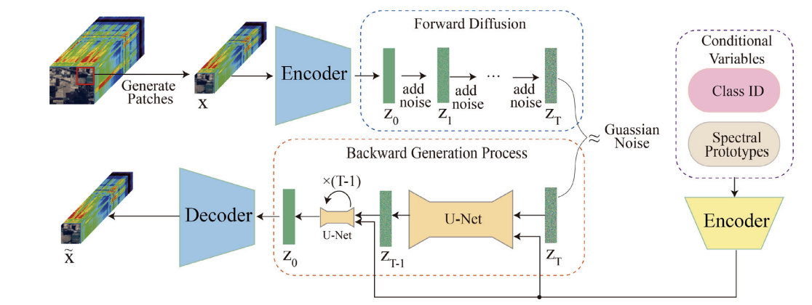
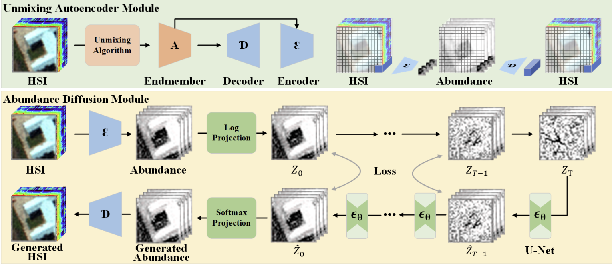

# `Synthesis of Hyperspectral Skin Lesion Images for Data Augmentation using Generative Models`
# `Síntese de um Dataset Hiperespectral de Lesões de Pele utilizando IA Generativa `

## Presentation

This project originated in the context of the graduate course *IA376N - Generative AI: from models to multimodal applications*, 
offered in the second semester of 2025, at Unicamp, under the supervision of Prof. Dr. Paula Dornhofer Paro Costa, from the Department of Computer and Automation Engineering (DCA) of the School of Electrical and Computer Engineering (FEEC).

|Name  | RA | Specialization|
|--|--|--|
| Kristhian André Oliveira Aguilar  | 298976  | Computer Engineering|
| Ana Clara Caznok Silveira  | 231745  | Computer Engineering|
| Aline Yoshida Machado | 265732 | Physics Engineering|

## Project Summary Description
Hyperspectral Imaging (HSI) combines imaging and spectroscopy, giving each pixel a continuous spectrum across wavelengths. HSI captures how light interacts with molecules, as their composition, vibrations, and structure affect photon behavior. These light–matter interactions create distinct spectral patterns that act like unique “fingerprints” for each material. Thanks to its ability to distinguish different materials, tissues, and substances, Hyperspectral Imaging (HSI) has become a valuable tool in Remote Sensing, Agriculture, and Medicine. In medicine, its capacity to go beyond standard RGB imaging is mainly used to detect tumors. However, publicly available hyperspectral tumor datasets are scarce, which often leads classification models to overfit or perform poorly in subsampled classes.

### Main goal
Therefore, the main goal of this project is to construct a generative ai model that learns the distribution of real hyperspectral images and through them is able to create a synthetic hyperspectral medical dataset. 
Desired output: a synthetic hyperspectral dataset of skin lesions and melanoma. 

### Presentation
#### Slides
https://docs.google.com/presentation/d/1lx3-yT1-Smwg8uxjNo1hsLG3ESJFPZldXnlBdIy1wgo/edit?usp=sharing

## Proposed Methodology
> For the first submission, the proposed methodology must clarify:  
> * Which dataset(s) the project intends to use, justifying the choice(s).
> * Which generative modeling approaches the group already sees as interesting to be studied.  
> * Reference articles already identified and that will be studied or used as part of the project planning.  
> * Tools to be used (based on the group’s current vision of the project).  
> * Expected results.  
> * Proposal for evaluating the synthesis results.
### Tools to be used
The project will be developed using Python, with the following libraries:
- TensorFlow/Keras or PyTorch for building and training the generative models.
- NumPy, Pandas and matplotlib for data exploration, manipulation and analysis.
- Scikit-learn for implementing classic machine learning algorithms and evaluation metrics.
- OpenCV and PIL for image processing tasks.
- Jupyter Notebooks for experimentation.
- [pytorch-lightning-template](https://github.com/DavidZhang73/pytorch-lightning-template/tree/main) to structure the code in a modular and organized way. This template includes:
  - `wandb` for experiment tracking and visualization.
  - `hydra` for configuration management.
  - `pytorch-lightning` for simplifying the training loop and model management.
  - `torchmetrics` for easy access to common metrics.

### Generative Models

#### 3D-GAN [4]
- The input of the discriminator are HSI images with spacial and spectral information. Initially the spectral bands are reduced using PCA preserving the top 3 components that retain most spectral energy while keeping spatial information  
- The generator's inputs a random noise vector `z` plus class label `c` and outputs a synthetic spectral–spatial patches shaped like real HSI data after PCA. Its architecture is composed by convolutional layers and batch normalization layers  
- The discriminator recieves the real and fake images, outputs a sigmoid classifier to distinguish real vs. fake and a softmax classifier to predict the class of the input patch  

#### AD-GAN [5]
This GAN is similar to 3D-GAN's structure, however there are two modifications:
1. Uses Adaptive DropBlock (AdapDrop) as regularization to avoid overfitting and improve diversity
2. discriminator D has one output that returns either a specific class c or the fake label

#### SHS GAN [6]

- The model receives as input a standard RGB image and its task is to generate a synthetic hyperspectral cube. The objective of the Generator is to learn a mapping from the RGB domain to the HS domain, so that the distribution of the synthetic HS cubes becomes similar to the distribution of real HS cubes.

- the RGB image is used as input to the Generator so that the synthetic HS cube preserves the spatial details and textures of the input image and also keeps the color properties coherent with what appears in the RGB.

- The Critic is trained to evaluate whether the generated HS cubes are realistic. It does so by analyzing spatial patterns and also the smoothness and shape of spectral curves, which are emphasized by looking at the data in both the image and Fourier-transformed spectral domains.

- In addition, the synthetic HS cube can be converted back into RGB using a deterministic transformation. This reconstructed RGB image is compared to the original input RGB, and differences are penalized during training. This step enforces consistency between the generated HS cube and the original RGB image.

- It is used a WGAN training pipeline

#### DiffusionAAE [7]
- Learn a compact latent space for hyperspectral patches with an Adversarial Autoencoder
- Learn a class-conditional diffusion process in that latent space so it can generate realistic hyperspectral samples and improve classification robustness with high-quality augmentations.
- The inputs of the models are HSI cubes and class labels

### HUD Model
- Uses a Unmixing Autoencoder (UAE) to project hyperspectral images into a low-dimensional abundance space.
- Latent code has physical meaning (endmember abundances)
- A U-Net diffusion model operates in the abundance space instead of raw spectral space. Learns to denoise Gaussian noise into valid abundance maps and ensures generated HSIs are both diverse and physically consistent.

#### Autoencoder
- The autoencoder is composed by an encoder and a decoder. The encoder compresses the input HSI image into a lower-dimensional latent representation, while the decoder reconstructs the original image from this representation.
- A variational autoencoder (VAE) is a type of autoencoder that learns a probabilistic mapping from the input data to a latent space, allowing for the generation of new samples by sampling from this latent space.
- VAEs are especially adept at modeling complex, high-dimensional data and continuous latent spaces, making them extremely useful for tasks like generating diverse sets of similar images.
- Palsson et al. [2] used a VAE paired with a GAN framework to generate high-resolution synthetic hyperspectral images.
- Liu et al. [3] proposed a model inspired autoencoder (MIAE) to fuse low-resolution HSI with high-resolution RGB images to generate high-resolution HSI.

### Evaluating synthesis results
We would like for the generated images to be: clear, realistic and useful. 
- Image Clarity/Quality : Variance, Spatial and Spectral Entropy, SNR
- Image realism : Spectral Angle Mapper for average melanoma spectral signature , SSIM with real images
- Usability: Given a baseline classifier that classifies images into melanoma and not melanoma, first train the classifier with only real data then with real + synthetic data and see if F1 score improves. Then, train only on synthetic data and test on real data to see if classifier performs similarly 

## Schedule

## Expected Results
Working with HSI is inherently challenging due to the high dimensionality of the data. Each sample contains both spatial information and spectral information. Designing a generative model that captures both faithfully is a difficult task. In addition, the computational cost of training such models grows rapidly with input size and number of spectral bands. This is particularly critical in our context, where GPU resources may be limited.

Another consideration is dataset size. Our dataset contains 348 hyperspectral skin images (272 × 512 × 16) divided into three classes. Compared to the benchmark HSI datasets used in generative AI research, which have thousands of labeled pixels or hundreds of spectral bands and our dataset is smaller in both sample count and spectral dimension. This difference might lead to lower metric scores than those reported in  studies.

Regarding the models to be tested:

- GANs:
We expect GANs to generate visually plausible HSI skin patches, but with the known risks of training instabilities and mode collapse. 

- VAEs:
VAEs will likely train in a more stable way and provide a well-structured latent space. However, they are prone to producing over-smoothed samples, lacking fine-grained spatial detail or realistic spectral variability. This makes them useful as a baseline model, but we do not expect VAEs to outperform GANs or diffusion models in terms of sample realism.

- Diffusion models:
Diffusion models are expected to produce the most realistic and diverse samples, preserving both spatial and spectral structures of hyperspectral skin images. However, diffusion models come with the highest computational cost and slowest sampling speed. In our setting, these constraints might limit the maximum patch size or the the necessity to encode the data before adding noise.

Despite these limitations, if the generated synthetic data reaches a reasonable quality level, it can still provide significant value. The main benefit would be data augmentation.

## Bibliographic References
1. D. A. Abuhani, I. Zualkernan, R. Aldamani and M. Alshafai, "Generative Artificial Intelligence for Hyperspectral Sensor Data: A Review," in IEEE Journal of Selected Topics in Applied Earth Observations and Remote Sensing, vol. 18, pp. 6422-6439, 2025, doi: https://doi.org/10.1109/JSTARS.2025.3538759.
2. Palsson, Burkni, Magnus O. Ulfarsson, and Johannes R. Sveinsson. 2023. "Synthesis of Synthetic Hyperspectral Images with Controllable Spectral Variability Using a Generative Adversarial Network" Remote Sensing 15, no. 16: 3919. https://doi.org/10.3390/rs15163919
3. Liu, J., Wu, Z., Xiao, L., & Wu, X. J. (2022). Model Inspired Autoencoder for Unsupervised Hyperspectral Image Super-Resolution. IEEE Transactions on Geoscience and Remote Sensing, 60, 1-12. https://doi.org/10.1109/tgrs.2022.3143156

4. L. Zhu, Y. Chen, P. Ghamisi and J. A. Benediktsson, "Generative Adversarial Networks for Hyperspectral Image Classification," in IEEE Transactions on Geoscience and Remote Sensing, vol. 56, no. 9, pp. 5046-5063, Sept. 2018, doi: 10.1109/TGRS.2018.2805286.

5. J. Wang, F. Gao, J. Dong and Q. Du, "Adaptive DropBlock-Enhanced Generative Adversarial Networks for Hyperspectral Image Classification," in IEEE Transactions on Geoscience and Remote Sensing, vol. 59, no. 6, pp. 5040-5053, June 2021, doi: 10.1109/TGRS.2020.3015843.

6. J. Hauser, G. Shtendel, A. Zeligman, A. Averbuch and M. Nathan, "SHS-GAN: Synthetic Enhancement of a Natural Hyperspectral Database," in IEEE Transactions on Computational Imaging, vol. 7, pp. 505-517, 2021, doi: 10.1109/TCI.2021.3079818.

7. Cao, Z., Li, J., & Xu, X. (2025). DiffusionAAE: Enhancing hyperspectral image classification with conditional diffusion model and Adversarial Autoencoder. Ecological Informatics, 87, 103118. https://doi.org/10.1016/j.ecoinf.2025.103118
