# `Synthesis of Hyperspectral Skin Lesion Images for Data Augmentation using Generative Models`
# `Síntese de um Dataset Hiperespectral de Lesões de Pele utilizando IA Generativa `

## Presentation

This project originated in the context of the graduate course *IA376N - Generative AI: from models to multimodal applications*, 
offered in the second semester of 2025, at Unicamp, under the supervision of Prof. Dr. Paula Dornhofer Paro Costa, from the Department of Computer and Automation Engineering (DCA) of the School of Electrical and Computer Engineering (FEEC).

|Name  | RA | Specialization|
|--|--|--|
| Kristhian André Oliveira Aguilar  | 298976  | Computer Engineering|
| Ana Clara Caznok Silveira  | 231745  | Computer Engineering|
| Aline Yoshida Machado | 265732 | Physics Engineering|

# Abstract / Project Description
Hyperspectral Imaging (HSI) combines imaging and spectroscopy, giving each pixel a continuous spectrum across wavelengths. HSI captures how light interacts with molecules, as their composition, vibrations, and structure affect photon behavior. These light–matter interactions create distinct spectral patterns that act like unique “fingerprints” for each material. Thanks to its ability to distinguish different materials, tissues, and substances, Hyperspectral Imaging (HSI) has become a valuable tool in Remote Sensing, Agriculture, and Medicine. In medicine, its capacity to go beyond standard RGB imaging is mainly used to detect tumors. However, publicly available hyperspectral tumor datasets are scarce, which often leads melanoma classification models to overfit or perform poorly in subsampled classes. Therefore, the main goal of this project is to construct a generative ai model that creates a synthetic hyperspectral dermoscopy dataset. More specifically, we investigated how synthetic hyperspectral images affect the performance of a melanoma classifier, hoping that a classifier trained with both synthetic and real hyperspectral images, would outperform a classifier trained with only real images. 

To test this hypothesis, we trained generative models, including SHSGAN, DCGAN, FastGAN and VAE, to produce realistic hyperspectral melanoma images and evaluated their quality using spectral and perceptual metrics. Among them, FastGAN achieved the best balance between spectral accuracy and structural realism, generating synthetic lesions that closely resembled real samples. These synthetic images were then integrated into the training of melanoma classifiers based on DenseNet and ResNet architectures. The classifiers trained with both real and synthetic data outperformed those trained solely on real data, achieving higher validation accuracy (0.84 vs. 0.79) and F1-score (0.89 vs. 0.85).

# Main Goal
Therefore, the main goal of this project is to construct a generative ai model that learns the distribution of real hyperspectral images and through them is able to create a synthetic hyperspectral melanoma dataset. Desired output: a synthetic hyperspectral dataset of skin lesions and melanoma. 
## Main Hypothesis 
A classifier trained with synthetic AND real data will have better results than if only trained in real data

## Secondary Questions
This work also explores the general use of hyperspectral synthetic data to improve classification. In order to support the use of synthetic images we also ask the following questions: 
- Is synthetic data truly necessary to improve classification performance, or can conventional data augmentation methods achieve similar gains?
- Does the inclusion of synthetic samples enhance the performance of a classifier trained from scratch when only a small amount of real data is available?
- Does synthetic data improve the performance of a generalist classifier pretrained on large-scale datasets such as ImageNet?
- Does it also benefit a specialist classifier pretrained on RGB melanoma images?
- Is synthetic data conditioned on RGB images superior to unconditioned synthetic data for improving classification performance?
- What is the optimal proportion of synthetic data to mix with real data during training?
- How does the quality of synthetic images influence downstream classifier performance?
- Can synthetic data substitute this dataset for melanoma classification?

## Presentation
### Slides
https://docs.google.com/presentation/d/16PthBsxWUrnjjb5saw3rDCTorvTyX7CcnbJKjngEmF8/edit?usp=sharing

## Dataset
- Github link: https://github.com/heugyy/HSIDermoscopy
- Dataset download link: https://drive.google.com/drive/folders/13ZXXxtUMjEzLAjoAqC19IJEc5RgpFf2f?usp=sharing

# Literature Overview on Hyperspectral Generative Models

#### SHS GAN [5]
The model receives as input a standard RGB image and its task is to generate a synthetic hyperspectral cube. The objective of the Generator is to learn a mapping from the RGB domain to the HS domain, so that the distribution of the synthetic HS cubes becomes similar to the distribution of real HS cubes. The RGB image is used as input to the Generator so that the synthetic HS cube preserves the spatial details and textures of the input image and also keeps the color properties coherent with what appears in the RGB. The Critic is trained to evaluate whether the generated HS cubes are realistic. It does so by analyzing spatial patterns and also the smoothness and shape of spectral curves, which are emphasized by looking at the data in both the image and Fourier-transformed spectral domains. In addition, the synthetic HS cube can be converted back into RGB using a deterministic transformation. This reconstructed RGB image is compared to the original input RGB, and differences are penalized during training. This step enforces consistency between the generated HS cube and the original RGB image. It is used a WGAN training pipeline

  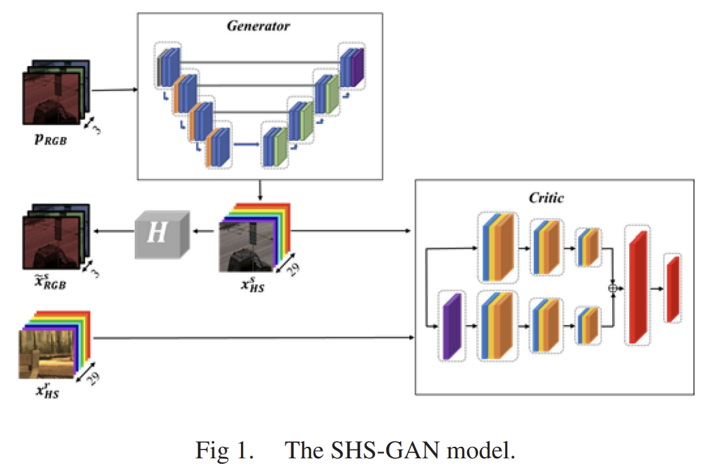

#### FastGAN
- **Minimalist Architecture:** The model uses a lightweight GAN structure with a single convolution layer per resolution and very few channels (e.g., three) at high resolutions ($\ge 512^2$) to ensure low computational cost and fast training.
- **Skip-Layer Excitation (SLE):** A core module designed for faster training. It strengthens the gradient flow by using feature maps from low-resolution layers (e.g., $8^2$) to perform channel-wise re-calibration (multiplication) on feature maps at high-resolution layers (e.g., $128^2$).
- **Self-Supervised Discriminator:** To prevent the discriminator (D) from overfitting on small datasets, it is regularized using a self-supervised task.
- **Auto-Encoding Regularization:** The discriminator is trained as an encoder, and small, auxiliary decoders are added to reconstruct intermediate feature maps back into images. This forces D to learn comprehensive and descriptive features from the real images.
- **Perceptual Loss ($\mathcal{L}_{recons}$):** The discriminator's auto-encoding regularization is achieved using a perceptual loss (LPIPS). This loss compares the reconstructed images generated by the discriminator's decoders against the original, forcing the discriminator to learn meaningful and comprehensive features rather than just memorizing.
- **Hinge Loss:** The model employs the hinge version of the adversarial loss for iteratively training the generator and discriminator, as it was found to compute the fastest with little performance difference from other losses.
- **Unsupervised Disentanglement:** A direct benefit of the SLE module is that the generator automatically learns to disentangle style and content, enabling style-mixing applications similar to StyleGAN without the added complexity.

#### Autoencoder
The autoencoder is composed by an encoder and a decoder. The encoder compresses the input HSI image into a lower-dimensional latent representation, while the decoder reconstructs the original image from this representation. A variational autoencoder (VAE) is a type of autoencoder that learns a probabilistic mapping from the input data to a latent space, allowing for the generation of new samples by sampling from this latent space. VAEs are especially adept at modeling complex, high-dimensional data and continuous latent spaces, making them extremely useful for tasks like generating diverse sets of similar images. Palsson et al. [2] used a VAE paired with a GAN framework to generate high-resolution synthetic hyperspectral images. Liu et al. [3] proposed a model inspired autoencoder (MIAE) to fuse low-resolution HSI with high-resolution RGB images to generate high-resolution HSI. We used an AutoEncoder with a Convolutional Encoder and a UNet decoder

# Workflow and Methodology
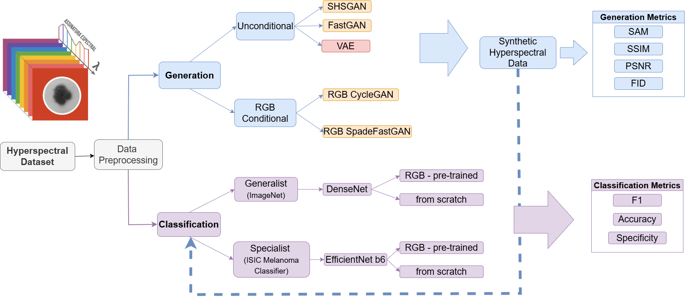
Our methodology was designed to test whether the inclusion of synthetic hyperspectral images can improve tumor classification compared to training with only real data. And if so, what are the experimental conditions necessary for that improvement. As shown in the workflow, the process begins with the preprocessing of the hyperspectral dataset, where images are segmented and cropped in the region containing the lesion. The preprocessed data are then used to generate synthetic data and also train a classification model that classifies between malignant melanoma and dysplasic nevi. 

The generation stage is divided into two strategies. Unconditional models (SHSGAN, FastGAN, and VAE) learn directly from the hyperspectral lesions. Conditional models (RGB CycleGAN and RGB SpadeFastGAN) use the RGB image of the lesion as additional guidance to produce the hyperspectral output. Both strategies aim to create synthetic images that faithfully represent real tissue. We assess the realism of the generated hyperspectral cubes through SAM, SSIM, PSNR, and FID metrics. These measurements ensure the synthetic samples capture both the spectral signature and overall visual quality of real lesions.

To understand how synthetic images influence malignant tumor classification, we evaluate two groups of classifiers: a generalist DenseNet, which benefits from ImageNet pretraining, and a specialist EfficientNet-b6, which incorporates prior knowledge from an RGB melanoma model trained on MILK10K. Both architectures are also tested when trained from scratch.
Each classifier is trained twice. We begin by training the model only on real hyperspectral data to set a performance baseline. We then retrain the same architecture using an expanded dataset that includes both real and synthetic hyperspectral images. Comparing these two training conditions using metrics such as F1-score, Accuracy, and Specificity, reveals when and for which model types synthetic data provides a meaningful advantage.

## Dataset Description
| Dataset | Web Address | Descriptive Summary |
| :--- | :--- | :--- |
| A Hyperspectral Dermoscopy Dataset | https://github.com/heugyy/HSIDermoscopy | A dataset of 330 hyperspectral dermoscopy images for melanoma detection. Each image has 16 spectral bands (465 nm to 630 nm) and includes histopathologically validated cases of melanoma, dysplastic nevus, and other lesion types. |
* **Size:** The dataset contains a total of **330 hyperspectral images**.
* **Format:** Each raw image is converted into a **$256 \times 512 \times 16$ data cube**. Each image contains **16 spectral bands** covering the visible wavelength spectrum from **465 nm to 630 nm**. The paper also states that "Each band image is constituted of approximately $512 \times 272$ pixels".
* **Annotation:** All 330 images are **histopathologically validated**, meaning the diagnosis for each image was confirmed by pathologists after a biopsy.
* **Class Distribution:** 
  * Melanoma: 85 images.
  * Dysplastic Nevus: 175 images.
  * Other Lesions: 70 images.
* The "Other" category includes solar lentigo, IEC, nevi, and Seborrheic Keratosis.
  
## Data Preprocessing
#### Semi-Automatic Segmentation of Skin Lesions
* The primary goal of this step is to isolate skin lesions from the surrounding healthy skin in the hyperspectral images. This isolation is crucial for training the generative models, as it allows them to focus on learning the characteristics of the lesions without being influenced by irrelevant background information.
* Initially, to facilitate the creation of segmentation masks, each 16-channel hyperspectral image is converted into a false RGB PNG image. This is achieved by calculating the average value across all 16 channels and repeating this average three times to create a grayscale-like RGB image. These false RGB images are exclusively used for the segmentation step.
* We utilize Label Studio in conjunction with the Segment Anything Model 2 (SAM2) for semi-automatic annotation.
* For every false RGB image, a segmentation mask is created for each skin lesion present. SAM2 assists in efficiently outlining the lesions, and human annotators refine these masks to ensure accuracy. Each distinct lesion within an image receives its own individual mask. This segmentation process is applied to all 330 images in the dataset.

#### Cropped Hyperspectral Image Generation
* After the segmentation masks are generated, we return to the original 16-channel hyperspectral images (not the false RGB versions).
* For every segmented skin lesion mask within an image, we generate a corresponding cropped hyperspectral image, obtained from the bounding box of the segmentation mask.
* To capture relevant neighboring skin information crucial for classification, the bounding box is scaled by a 50% margin. This ensures that the cropped image includes not just the lesion but also a surrounding area of skin.

## Evaluating synthesis results
We would like for the generated images to be: clear, realistic and useful. 
- Image Clarity/Quality : Peak Signal-to-Noise Ratio (PSNR)
- Image realism : Spectral Angle Mapper (SAM) for average melanoma spectral signature , SSIM with real images, adapted FID 
- Usability: Given a baseline classifier that classifies images into melanoma and not melanoma, first train the classifier with only real data then with real + synthetic data and see if F1 score improves. Then, train only on synthetic data and test on real data to see if classifier performs similarly 
---
Here are the following explanations for the most used metrics
####  Structural Similarity Index Measure (SSIM)
Measures the structural similarity between two images, focusing on luminance, contrast, and structural patterns.

**Equation:**
$`SSIM(x, y) = \frac{(2\mu_x \mu_y + C_1)(2\sigma_{xy} + C_2)}{(\mu_x^2 + \mu_y^2 + C_1)(\sigma_x^2 + \sigma_y^2 + C_2)}`$
where:
- $`\mu_x, \mu_y`$ are the means of images $x$ and $y$
- $`\sigma_x^2, \sigma_y^2`$ are their variances
- $`\sigma_{xy}`$ is their covariance
- $`C_1, C_2`$ are small constants to avoid division by zero
- Range: **[0, 1]**
- **SSIM ≈ 1** → high structural similarity  
- **SSIM ≈ 0** → weak similarity  

#### Peak Signal-to-Noise Ratio (PSNR)
Quantifies image reconstruction quality in terms of pixel-wise fidelity, how much noise or distortion is present compared to a reference image.

**Equation:**
$` PSNR(x, y) = 10 \log_{10}\left( \frac{L^2}{MSE} \right) `$
with
$`MSE = \frac{1}{N}\sum_{i=1}^{N}(x_i - y_i)^2`$
where $`L`$ is the maximum possible pixel value (e.g., 1.0 or 255).
- Higher PSNR → better image quality
- Typical values:
  - \> 40 dB → excellent
  - 30–40 dB → good
  - < 30 dB → degraded or noisy

#### Fréchet Inception Distance (FID)
Measures the distributional distance between real and generated image features extracted from a deep network (Inception-v3).  
It evaluates how close the overall statistics of generated images are to the real ones.
In our context, we must use an adapted FID, once the pre trained weights are fit for a 3-channel RGB input. Since we have a 16 channel image, it is not possible to perform the inference of the model. Therefore, we used the Inception V3 model with the excpetion of the first layer. This layer, we adapted to a 16-channel input by replicating the kernel weights untill it reached the desired channel.

**Equation:**
$`FID = \|\mu_r - \mu_g\|_2^2 + \text{Tr}\left(\Sigma_r + \Sigma_g - 2(\Sigma_r \Sigma_g)^{1/2}\right)`$
where:
- $`\mu_r, \Sigma_r`$: mean and covariance of features from **real images**
- $`\mu_g, \Sigma_g`$: mean and covariance of features from **generated images**
- Lower FID → better quality and diversity

#### Spectral Angle Mapper (SAM)
**Purpose:**  
Used for hyperspectral images, SAM measures the spectral similarity between two spectra (one per pixel) by computing the angle between their spectral vectors.

**Equation:**
$`SAM(x, y) = \arccos\left(\frac{x \cdot y}{\|x\| \, \|y\|}\right)`$
where $x$ and $y$ are spectral vectors of a pixel in the reference and generated images.
- **Units**: radians or degrees
- **Lower SAM** → higher spectral similarity

#### Summary Table

| Metric | Domain | Range | Better When | Evaluates |
|:-------|:--------|:-------|:--------------|:-------------|
| **SSIM** | Spatial | [-1, 1] | ↑ | Structural similarity |
| **PSNR** | Spatial | [0, ∞) dB | ↑ | Pixel-wise fidelity |
| **FID** | Feature / Perceptual | [0, ∞) | ↓ | Realism & diversity |
| **SAM** | Spectral | [0°, ∞°) | ↓ | Spectral shape similarity |
---

# Experiments, Results, and Discussion of Results
Our aim in this work is to offer a comprehensive understanding of how synthetic images influence classification. For that reason, we examine both our main hypothesis and the related secondary questions. This session is divided into two main components. The first describes the experimental process behind generating synthetic hyperspectral images, and the second examines the main and secondary research questions that this work aims to answer.

### Generative Model Training

#### Data Augmentations During Generative Model Training
During the model training phase, the cropped hyperspectral images undergo a series of augmentations using the `albumentations` library. These augmentations are vital for addressing data scarcity and improving the model's generalization capabilities.
The applied augmentations include:
* **ShiftScaleRotate:** Randomly shifts, scales, and rotates the image.
* **RandomCrop:** Takes a random crop from the image.
* **VerticalFlip:** Flips the image vertically.
* **HorizontalFlip:** Flips the image horizontally.
After the augmentations are applied, the images undergo a final transformation to standardize their size and shape for model input:
* **SmallestMaxSize:** The image is resized such that its smallest dimension matches a predefined target size (e.g., 224 pixels).
* **CenterCrop:** A center crop is then applied to make the image perfectly square (e.g., 224x224 pixels) and of the appropriate dimensions for the input layer of the neural network model.
Additionally, each channel of the hyperspectral images is normalized using min-max normalization based on pre-calculated global minimum and maximum values for each channel across the entire dataset. This normalization ensures that the pixel values for each channel are scaled to a consistent range, typically between 0 and 1, which is crucial for stable and efficient training of the neural network models.

#### SHS GAN
The SHS-GAN experiment was initially used to synthesize 64×64 hyperspectral images of melanoma. The main goal was to reproduce and understand the implementation described in the reference paper, which proposed several techniques for handling hyperspectral data.
We began with a baseline DCGAN.  
The Generator consists of a sequence of transposed convolutional blocks that progressively upsample a latent vector into an image. Each block includes a `ConvTranspose2d`, followed by `BatchNorm2d` and `ReLU` activations, except for the final layer, which uses a `Tanh` activation. The architecture adapts to different image sizes (28×28, 64×64, 256×256) by adjusting the depth and number of filters. All weights are initialized with a normal distribution to ensure stable training.  
The Discriminator mirrors this structure using standard convolutional layers for downsampling. Each block includes `Conv2d`, optional `BatchNorm2d`, and `LeakyReLU` activations, with the last layer outputting a single scalar (without activation).
Next, we progressively introduced the main components of SHS-GAN and evaluated their impact on image synthesis, adapting each modification to our context. In the first experiment, we replaced the 2D convolutional filters in the discriminator with 3D convolutions. Since hyperspectral data includes an additional spectral dimension, convolving in three dimensions allows the network to capture spectral correlations that 2D convolutions cannot. In the second experiment, we replaced **Batch Normalization** with **Spectral Normalization**, a regularization method that stabilizes GAN training. It constrains the spectral norm (the largest singular value of each layer’s weight matrix) to 1, thereby controlling the Lipschitz constant of the network and improving stability.In the third experiment, we added a spectral-frequency arm, which processes the same hyperspectral cube after applying a Fast Fourier Transform (FFT) along the spectral dimension. The resulting spectral-frequency representation is then combined with the spatial arm (which contains standard convolutions), as proposed in the reference model.During training, we observed that the model was highly sensitive to hyperparameters, and only a narrow set of configurations produced realistic results. Some combinations generated pure noise, while others yielded better synthetic images.  
The batch size had a strong influence: given our dataset of approximately 70 melanoma images, small batch sizes (1, 2, or 4) produced plausible results, while larger batch sizes (≥16) led to unstable outputs and noise.

The training followed the WGAN formulation, using two key hyperparameters: `gradient_penalty` and `n_critic`.  The gradient penalty enforces the Lipschitz continuity constraint on the discriminator, preventing it from developing excessively steep gradients. This results in smoother and more realistic training dynamics, reducing mode collapse and improving convergence. The `n_critic` parameter defines how many times the critic is updated per generator update—commonly greater than one—to ensure the critic accurately estimates the Wasserstein distance before each generator step.  
In our setup, we used a gradient penalty of 10 and n_critic = 2. Another crucial hyperparameter was the learning rate, set to approximately **1×10⁻⁵**.  
Higher learning rates destabilized training, causing the generated images to fluctuate drastically across epochs, while extremely low rates resulted in persistent noise even after many epochs. Overall, our experiments indicate that incorporating 3D convolutional layers in the discriminator improves the synthesis of spectral characteristics, as shown in the comparison below. The spectral profiles generated using 3D convolutions are more consistent with the real data than those obtained with 2D convolutions.

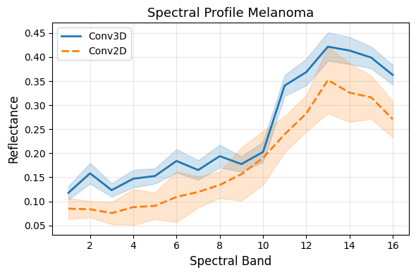

However, spectral normalization and the addition of the FFT arm did not lead to noticeable improvements.  
While further optimization might help, we believe this outcome is related to the limited spectral depth of our dataset (only a few channels), in contrast to the reference [6], which used data with 29 spectral bands.  
In our case, additional mechanisms designed to enhance spectral relationships may not have a significant impact given the lower spectral resolution.

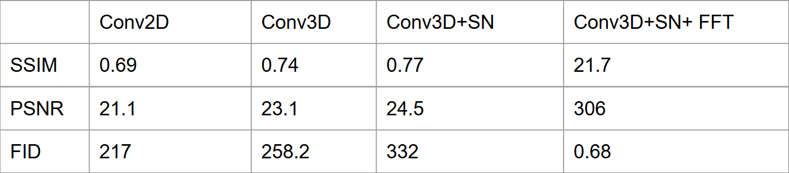

We expect the quality of synthetic hyperspectral images to improve with future generator optimizations.  
Our next step is to use RGB images as inputs to the generator instead of random noise and include a reconstruction loss between the generated and real RGB representations.  
This approach encourages the generator to learn meaningful spatial and color relationships, using them to reconstruct high-quality hyperspectral data.

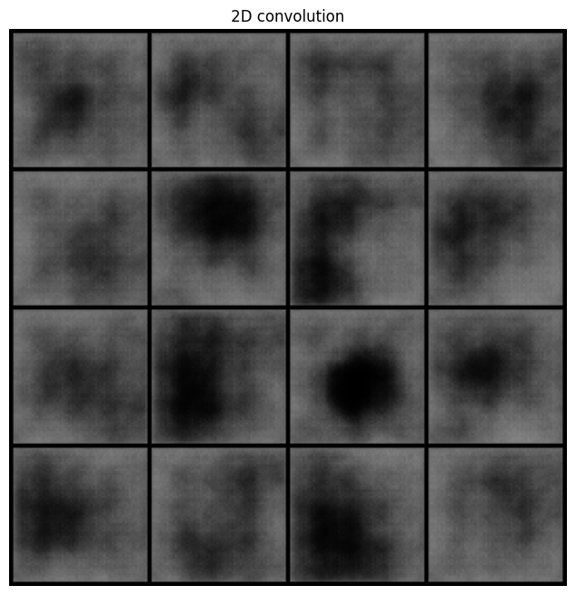  
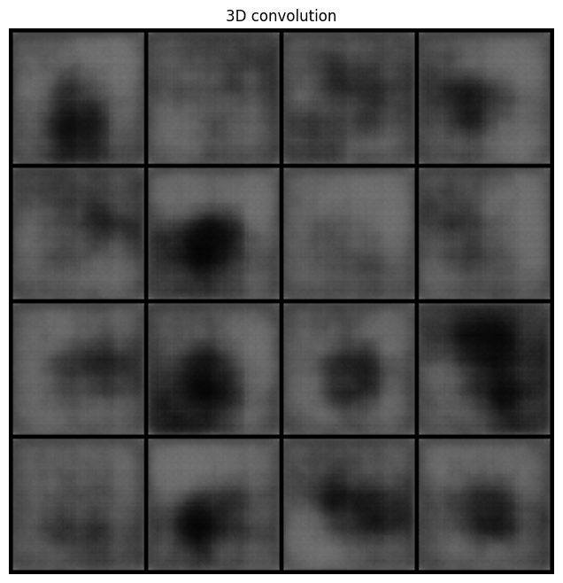  
  
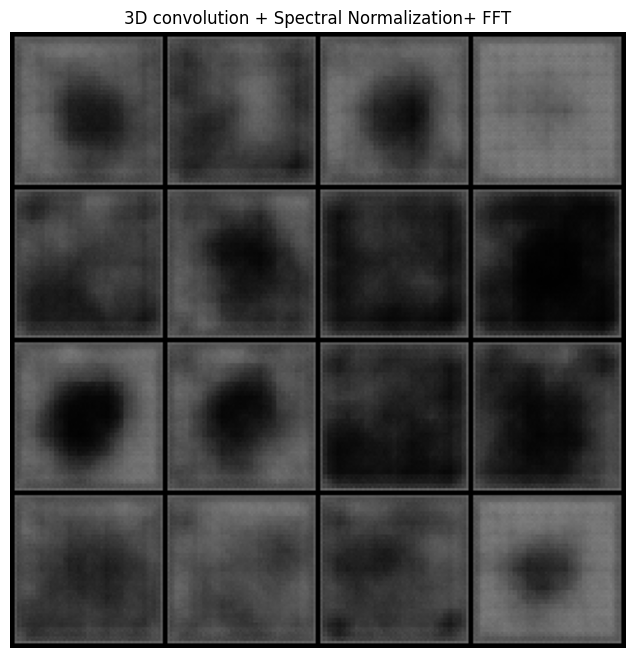
#### FastGAN
The FastGAN experiment was conducted to generate synthetic hyperspectral images of melanoma lesions using a 16-channel input configuration and an image size of 256×256 pixels. The model was trained with a learning rate of 0.0002 and a latent dimension of 256, following the original FastGAN training procedure that includes manual optimization, exponential moving average updates, and perceptual consistency losses. The goal was to evaluate how well the generator could reproduce realistic skin lesion patterns and retain spectral properties similar to real melanoma samples.  

Quantitatively, the model reached a Frechet Inception Distance (FID) of about 114.7, indicating a moderate difference between the distributions of real and generated images. The Spectral Angle Mapper (SAM) of 0.17 shows that the spectral shapes of synthetic images were reasonably aligned with those of real samples, meaning that the generator could preserve band relationships across the hyperspectral channels. The Relative Average Spectral Error (RASE) value, however, was high at around 3634, reflecting differences in reflectance magnitude between synthetic and real images. The Structural Similarity Index Measure (SSIM) of 0.67 suggests that the generated lesions shared similar overall spatial structures with real ones, although fine details and boundary sharpness were less well captured. The total variation metric indicated that the generated results were relatively smooth, with less noise but also less textural variation than real images. 

Visually, the comparison between real and synthetic melanoma images highlights several encouraging patterns. The synthetic lesions reproduced the typical round or irregular shapes of melanoma and maintained appropriate global contrast between lesion cores and surrounding skin. The overall appearance of the generated images was realistic enough to resemble natural skin textures, though a lack of diversity between generated samples and some intensity discrepancies were noted. Despite that, the model clearly learned the underlying structure and general appearance of melanoma lesions.

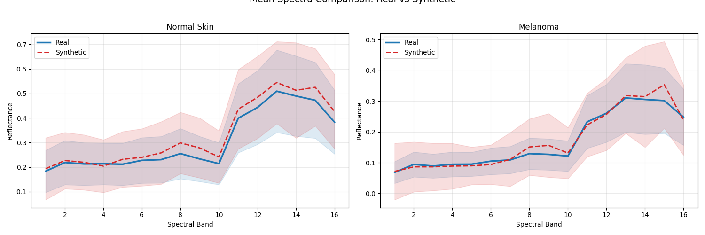

The spectral analysis supported these visual findings. The plotted mean spectra showed that the synthetic and real data followed nearly the same trends across most wavelengths. Normal skin spectra overlapped closely, demonstrating that the model learned background reflectance behavior, while melanoma lesion spectra exhibited similar shapes but slightly shifted magnitudes. This agrees with the spectral metrics and suggests that FastGAN was able to reproduce physically plausible spectral patterns.  

Overall, the experiment demonstrates that FastGAN is a viable architecture for hyperspectral skin lesion synthesis. The generated images capture the main structural and spectral traits of melanoma lesions, providing a realistic extension of the training data space. While further optimization is needed to improve texture detail, reduce intensity discrepancies and increase sample diversity, these results show promising potential for using generative adversarial methods to augment hyperspectral datasets and support skin cancer research.

#### Conditioned FastGAN
Conditional FastGAN extends the original FastGAN by introducing explicit conditioning information that guides image generation. Instead of using only a noise vector as input, it concatenates this noise with an external conditioning mask, allowing the generator to model the conditional distribution p(x∣m) rather than the unconditional 
p(x). This same conditioning vector is also fed to the discriminator, enabling it to judge not just whether an image looks real, but whether it matches the provided condition. 

#### SPADE FastGAN
SPADE-FastGAN introduces spatially adaptive normalization (SPADE) to replace the standard BatchNorm layers inside the upsampling and downsampling blocks. Unlike Conditional FastGAN, which uses masks only as an input vector, SPADE provides pixel-level conditioning, which is a semantic or structural map is fed into every normalization layer, producing gamma and beta parameters that modulate activations at each spatial location. This means the generator is guided by the conditioning map throughout the entire hierarchy, ensuring that spatial structure such as shapes, boundaries, textures, is preserved with high fidelity. SPADE-FastGAN also extends this conditioning mechanism to the discriminator.

  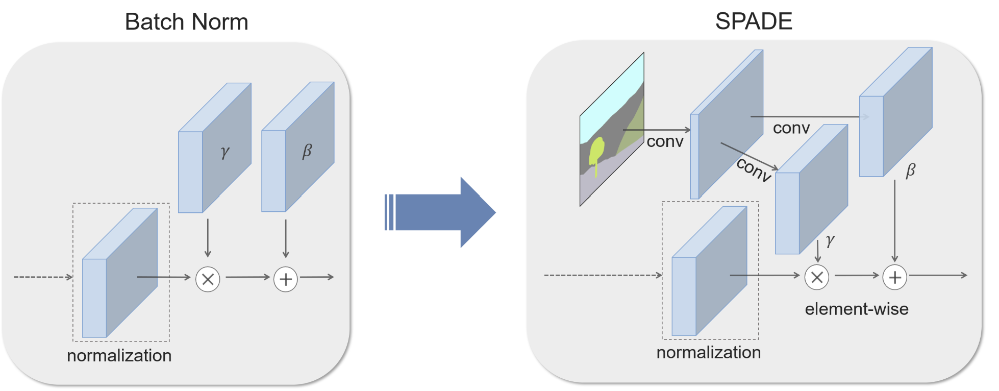

  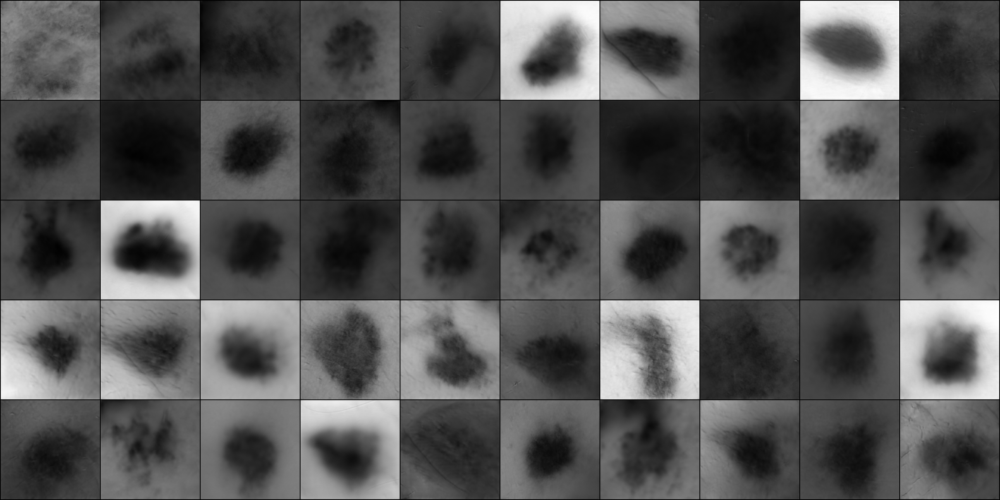

#### Cycle GAN
CycleGAN is a training approach that learns image translation between two unpaired domains, which in our context is RGB and HSI images. Unlike supervised models that require aligned RGB–HSI pairs, CycleGAN uses a set of complementary losses that make training possible with independent datasets. The key idea is the cycle-consistency constraint, which is that if we translate an RGB image into an HSI image and then pass it back through the inverse generator, we should recover the original RGB image. This constraint forces both generators to learn transformations that are meaningful avoiding degenerate solutions, allowing CycleGAN to synthesize high quality hyperspectral outputs from RGB inputs.

  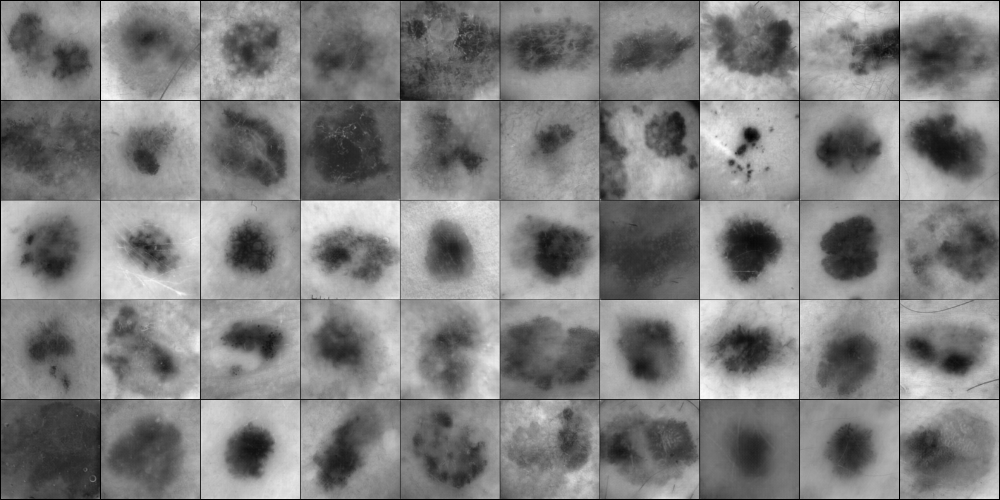

  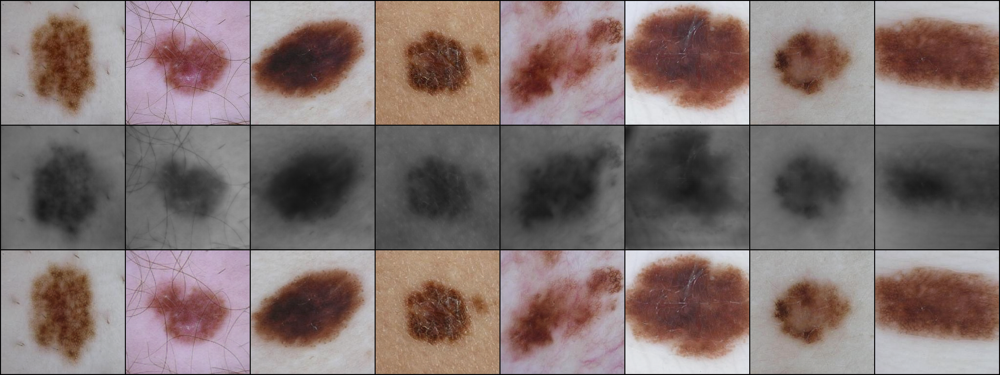

#### VAE Autoencoder 

Similarly as the FastGAN, VAE autoencoder was trained with a 16-channel input configuration and an image size of 256×256 pixels. The model was trained with a learning rate of 0.0002 and a latent dimension of 64. Loss function was set to have a term with a KL-divergence regularizer weighted by kld_weight = 1×10⁻², encouraging smooth, semantically meaningful latents while preserving spectral fidelity. Overall the results look like melanoma images but lack the details present in a realistic hyperspectral image. Spectral similarity was also achieved. 
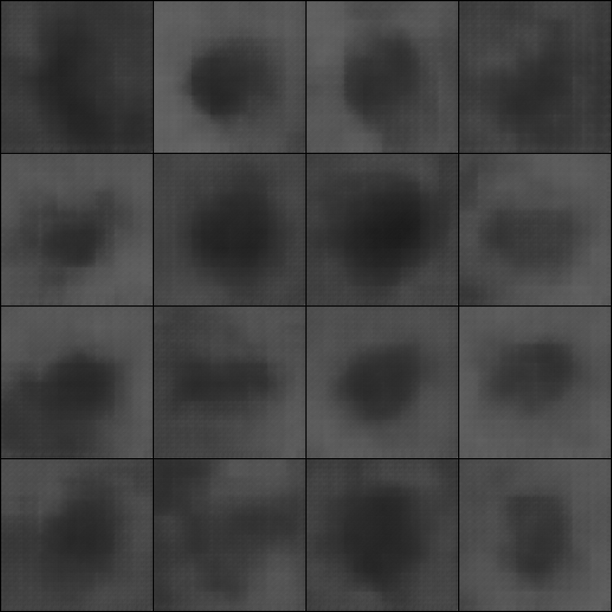
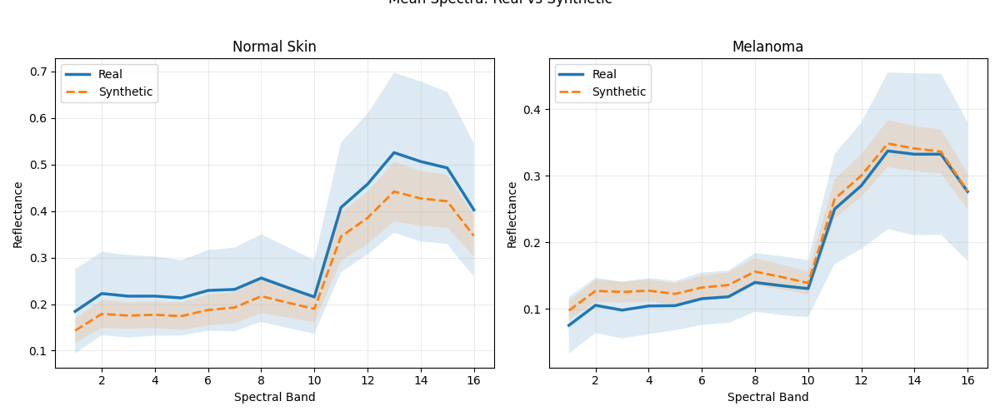

## Classifier Training with Synthetic Data 

### Is synthetic data truly necessary to improve classification performance, or can conventional data augmentation methods achieve similar gains?

The first series of classification experiments aimed to determine whether traditional data balancing strategies could effectively improve melanoma classification, or if a synthetic hyperspectral dataset would be necessary to achieve better performance—especially for underrepresented classes. Experiments were performed in total using the **DenseNet201** architecture trained from scratch and synthetic images were obtained through FastGAN architecture. These experiments compared different balancing strategies—Focal Loss, Batch Regularization, and their combination—against a baseline trained with no balancing method.

The baseline model performed well, achieving 0.8852 F1 and 0.6429 specificity, and it remained the best result among all experiments that used only real data.
Real-data augmentations and balancing strategies did not outperform the baseline. Batch Regularization and Focal Loss reduced either F1-score or specificity, and their combination produced the weakest results. Even extensive augmentations such as rotation, equalization, normalization, and flipping reached only 0.8667 F1, slightly below the baseline.

The best performance came from using synthetic images. Training with synthetic hyperspectral data alone produced the highest F1-score (0.9000) and the highest specificity (0.7143). When synthetic samples were combined with traditional augmentations, results remained strong and continued to outperform the real-only augmented model.

| ID | Augmentation                       | Synthetic data | Val F1  | Specificity | 
|:--:|:-----------------------------------|:--------------:|:-------:|:-----------:|
| 1  | NONE                               | No             | 0.8852  | 0.6429      |
| 2  | Batch Reg                          | No             | 0.8571  | 0.5000      |
| 3  | Focal Loss                         | No             | 0.8889  | 0.5714      |
| 4  | Batch Reg + Focal Loss             | No             | 0.8750  | 0.5000      |
| 5  | NONE                               | Yes            | 0.9000  | 0.7143      |
| 6  | Rotate90 + Equalize + Norm + Flip  | No             | 0.8667  | 0.6429      |
| 7  | Rotate90 + Equalize + Norm + Flip  | Yes            | 0.8814  | 0.7143      |

The experiments showed that traditional data balancing methods did not enhance the model’s performance. The highest F1-score and balanced sensitivity-specificity tradeoff were obtained when no balancing strategy was used. DenseNet201 performed best with the natural data distribution, suggesting that the limited dataset size and class imbalance hindered the effectiveness of focal loss and regularization techniques.

However, these results are not fully generalizable. When evaluated on the test dataset, all models showed lower F1-scores. Although the synthetic-data model (Test F1 = 0.75) performed better than the baseline without augmentation (Test F1 = 0.73), it was still surpassed by the focal loss model (Test F1 = 0.78). These differences highlight a substantial mismatch between the validation and test distributions, indicating that additional testing is needed to assess if using synthetic data outperforms traditional data-agumentation in real-world conditions. 

### Does the inclusion of synthetic samples enhance the performance of a classifier trained from scratch when only a small amount of real data is available?
The objective of this experiment was to verify whether training a hyperspectral dermoscopy skin lesion classifier with additional synthetic melanoma data, generated using the FastGAN architecture, could improve performance in distinguishing melanoma from dysplastic nevi. The classifier was trained on the cropped hyperspectral images, the only difference between the two experiments being that the second training included synthetic melanoma samples to balance the dataset, ensuring that the number of melanoma and dysplastic nevi instances was equal.  

| ID | Arquitecture | Synthetic data | Val F1  | Val Specificity | Test F1 | Test Specificity |
|:--:|:------------:|:--------------:|:-------:|:---------------:|:-------:|:----------------:|
| 1  | Densenet201  | No             | 0.8852  | 0.6429          | 0.73    | 0.53             |
| 2  | Densenet201  | Yes            | 0.9000  | 0.7143          | 0.75    | 0.26             |

The results show a clear improvement during validation when synthetic data is included. Validation F1 increased from 0.8852 in the real-only model to 0.9000 when synthetic melanoma samples were added. Specificity also improved substantially, from 0.6429 to 0.7143, suggesting that synthetic samples helped the model better distinguish melanoma from dysplastic nevi under controlled validation conditions.

However, performance on the independent test set reveals a more nuanced picture. The synthetic-data model achieved a slightly higher Test F1 (0.75) than the real-only model (0.73), indicating a modest benefit in generalization. Yet, the test specificity dropped from 0.53 to 0.26, suggesting that while the model became more sensitive to melanoma, it did so at the expense of misclassifying more dysplastic nevi.

Overall, these results suggest that synthetic melanoma samples can enhance performance when real data is scarce, particularly in terms of F1-score and validation robustness. However, the drop in test specificity highlights that synthetic augmentation may shift the decision boundary, causing the classifier to overpredict melanoma in unseen data. This indicates that synthetic data is helpful but should be used carefully—ideally complemented by additional real samples or more diverse synthetic generation—to avoid degrading specificity in real-world settings.

### Does synthetic data improve the performance of a generalist classifier pretrained on large-scale datasets such as ImageNet?

### Is synthetic data conditioned on RGB images superior to unconditioned synthetic data for improving classification performance?
To answer this question, we compared the performance of DenseNet201 classifiers trained with synthetic hyperspectral images generated by unconditioned and RGB-conditioned generative models. The unconditioned model used was FastGAN, while the RGB-conditioned models employed were:
- CycleGAN, which translates RGB images to hyperspectral images without paired data [13].
- SPADE FastGAN, which generates hyperspectral images conditioned on RGB inputs using spatially-adaptive normalization (SPADE) [12].

All rgb-conditioned models were trained using RGB images from the MILK10K dataset [10], which contains a large number of dermoscopic RGB images of skin lesions. The synthetic hyperspectral images generated by these models were then used to augment the training set for DenseNet201 classifiers, which were pretrained on ImageNet.

The figure below compares the performance of classifiers trained with synthetic datasets generated by three models, CycleGAN, SPADE FastGAN, and FastGAN, against the best real-data baseline across four key validation metrics: F1-score, specificity and recall. Each subplot shows the baseline performance as a blue dotted line and the corresponding synthetic results as red bars.

The results indicate that SPADE FastGAN and unconditioned FastGAN both surpassed the real-data baseline in F1-score, while CycleGAN obtained results comparable to the baseline. The lower performance of CycleGAN may be attributed to its architecture, which impose a high regularization through cycle-consistency loss, potentially limiting its ability to generate high-fidelity hyperspectral images.

Notably, SPADE FastGAN achieved the same results as FastGAN in all four metrics, suggesting that conditioning on RGB images did not provide a significant advantage over unconditioned generation in this context. This outcome may be due to the gap between RGB and hyperspectral modalities, where the additional information from RGB images does not translate effectively into improved hyperspectral synthesis for classification purposes.

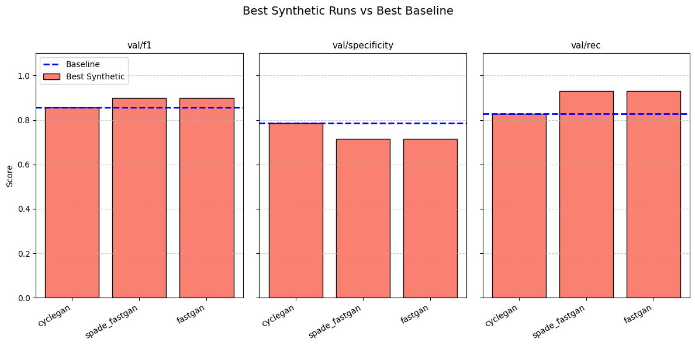

### Does it also benefit a specialist classifier pretrained on RGB melanoma images?
We utilized an EfficientNet-b6 model, pretrained on the ISIC 2019 melanoma dataset [7-9], to evaluate the impact of synthetic hyperspectral data on a specialist classifier. The weights for this model were obtained from the second place solution of the SIIM-ISIC Melanoma Classification Challenge 2020 [11], which focused on classifying dermoscopic images into melanoma and non-melanoma categories.

In order to adapt the model to hyperspectral input, we modified the first convolutional layer to accept 16 channels instead of the original 3, with the same technique used for DenseNet201. Additionaly, an untrained classification head was added to output binary predictions (melanoma vs. dysplastic nevus). The model was fine-tuned on our hyperspectral dermoscopy dataset under two conditions: first, using only real hyperspectral images, and second, incorporating synthetic melanoma samples.

The table below summarizes the validation metrics for both the DenseNet201 and ISIC2019-EfficientNet-b6 models, comparing performance when trained solely on real data versus when synthetic data is included. The best model for the DenseNet201 architecture utilized an unconditioned FastGAN to generate synthetic hyperspectral images, while the ISIC2019-EfficientNet-b6 model benefited from synthetic data produced by a SPADE FastGAN conditioned on RGB images from the MILK10K dataset.

The results indicate that both architectures benefited from the addition of synthetic hyperspectral images, achieving higher F1-scores and balanced accuracy. Notably, the EfficientNet-b6 model, which leverages prior knowledge from RGB melanoma images, showed comparable improvements to the DenseNet201, suggesting that synthetic data can enhance performance regardless of the base architecture or pretraining strategy. 

However, not only does the EfficientNet-b6 model have a significantly higher number of parameters (66 million vs. 20 million for DenseNet201), but it also required a generative model trained on both hyperspectral and RGB data to achieve comparable results to the DenseNet201 model, which was trained with a simpler unconditioned FastGAN. In conclusion, the use of a specialist classifier pretrained on RGB melanoma images does not appear to provide a substantial advantage over a generalist classifier like DenseNet201 when both are augmented with high-quality synthetic hyperspectral data, possibly due to a gap in domain adaptation between RGB and hyperspectral modalities.

| Metric               | Best DenseNet201 Baseline | Best DenseNet201 Synthetic | Best ISIC2019-EffNetB6 Baseline | Best ISIC2019-EffNetB6 Synthetic |
|----------------------|---------------------------|-----------------------------|----------------------------------|----------------------------------|
| Val F1               | 0.885246                 | 0.9                         | 0.857143                        | 0.9                              |
| Val Specificity      | 0.642857                 | 0.714286                    | 0.785714                        | 0.714286                         |
| Val Recall           | 0.931035                 | 0.931035                    | 0.827586                        | 0.931035                         |
| Generative Model     | —                        | FastGAN                     | —                               | SPADE FastGAN                    |

### Is synthetic data conditioned on RGB images superior to unconditioned synthetic data for improving classification performance?
To answer this question, we compared the performance of DenseNet201 classifiers trained with synthetic hyperspectral images generated by unconditioned and RGB-conditioned generative models. The unconditioned model used was FastGAN, while the RGB-conditioned models employed were:
- CycleGAN, which translates RGB images to hyperspectral images without paired data [13].
- SPADE FastGAN, which generates hyperspectral images conditioned on RGB inputs using spatially-adaptive normalization (SPADE) [12].

All rgb-conditioned models were trained using RGB images from the MILK10K dataset [10], which contains a large number of dermoscopic RGB images of skin lesions. The synthetic hyperspectral images generated by these models were then used to augment the training set for DenseNet201 classifiers, which were pretrained on ImageNet.

The figure below compares the performance of classifiers trained with synthetic datasets generated by three models, CycleGAN, SPADE FastGAN, and FastGAN, against the best real-data baseline across four key validation metrics: F1-score, specificity, recall, and balanced accuracy. Each subplot shows the baseline performance as a blue dotted line and the corresponding synthetic results as red bars.

The results indicate that SPADE FastGAN and unconditioned FastGAN both surpassed the real-data baseline in both F1-score and balanced accuracy, while CycleGAN obtained results comparable to the baseline. The lower performance of CycleGAN may be attributed to its architecture, which impose a high regularization through cycle-consistency loss, potentially limiting its ability to generate high-fidelity hyperspectral images.

Notably, SPADE FastGAN achieved the same results as FastGAN in all four metrics, suggesting that conditioning on RGB images did not provide a significant advantage over unconditioned generation in this context. This outcome may be due to the gap between RGB and hyperspectral modalities, where the additional information from RGB images does not translate effectively into improved hyperspectral synthesis for classification purposes.

### What is the optimal proportion of synthetic data to mix with real data during training?

To understand how much synthetic data should be used in training, we first checked whether synthetic melanoma (MM) and dysplastic nevi (DN) should be added in the same proportion as the real dataset or in a way that compensates for the real imbalance. Then, we tested how much synthetic melanoma should be added—either matching the number of real MM images or increasing it further. 
The results show that the most effective strategy is to reinforce only the melanoma class. The highest F1-score (0.8438) occurred when 100 synthetic melanoma images were added without introducing synthetic DN, indicating that focused augmentation of the minority class is more beneficial than attempting to rebalance both classes. Configurations that included synthetic DN (such as 100MM/50DN or 50MM/100DN) produced lower or equal F1-scores, ranging from 0.8254 to 0.8387, and did not surpass the melanoma-only approach. Even when real and synthetic melanoma counts were matched (66MM real with 66 synthetic MM), performance did not improve further.
Overall, targeted melanoma-only augmentation proved to be the most effective way to improve classifier performance in the mixed_train setting.

| ID | Real MM | Real DN | Synth MM | Synth DN | F1     | Specificity  | Balanced Accuracy |
|----|---------|---------|----------|----------|--------|--------------|-------------------|
| 1  | 66      | 134     | 50       | 0        | 0.8254 | 0.4285714328 | 0.66256           |
| 2  | 66      | 134     | 100      | 0        | 0.8438 | 0.4285714328 | 0.67980           |
| 3  | 66      | 134     | 100      | 50       | 0.8254 | 0.4285714328 | 0.66256           |
| 4  | 66      | 134     | 66       | 13       | 0.8387 | 0.5000000000 | 0.69828           |
| 5  | 66      | 134     | 50       | 100      | 0.8387 | 0.5000000000 | 0.69828           |

### How does the quality of synthetic images influence downstream classifier performance?

In order to investigate the relationship between the quality of synthetic hyperspectral images and the performance of downstream classifiers, we computed FID, SAM, Precision, and Recall metrics for various generative models used to produce synthetic data. We then trained DenseNet201 classifiers using the synthetic images generated by each model, combined with real hyperspectral data, and evaluated their performance on a validation set. The goal was to determine if higher-quality synthetic images, as indicated by better generative metrics, corresponded to improved classification results.

The figure below illustrates the correlation between the generative metrics (FID, SAM, Precision, and Recall) and the F1-score, specificity, and recall of the classifiers trained with the respective synthetic datasets. Each cell represents a Pearson correlation coefficient, with the color intensity indicating the strength and direction of the relationship: red tones correspond to positive correlations, and blue tones to negative correlations.

From the heatmap, it can be observed that none of the generative metrics show strong correlations (either positive or negative) with the classification performance metrics. Most correlation coefficients are close to zero, suggesting that the variations in synthetic data quality, as measured by FID, SAM, or image-level Precision and Recall, do not linearly translate into changes in classifier performance on the validation set.

Interestingly, FID shows a weak negative correlation with specificity (-0.18) and a small positive correlation with recall (0.14), meaning that lower FID (typically indicating better generative quality) might slightly correspond to higher recall but is not a reliable predictor. Similarly, SAM_mean has small positive and negative correlations with specificity (0.17) and recall (-0.08), respectively—again reflecting minimal influence.

These results suggest that traditional generative quality metrics such as FID and SAM may not fully capture the aspects of synthetic hyperspectral image quality that impact downstream classification. It’s possible that these metrics emphasize spectral or statistical similarity, whereas classification performance depends more on class-relevant features and the diversity of the generated samples. Consequently, future work might explore domain-specific evaluation methods or task-aware generative metrics to better assess whether synthetic hyperspectral data contribute meaningfully to classifier improvement.

### Can synthetic data substitute this dataset for melanoma classification?

In order to test this hypothesis we did 2 sets of experiments. The first we trained only on synthetic data and validated only on real data. The second one we trained only on real data and validated on synthetic data. In each set of experiments, we made so that the proportion of melanoma (MM) and dysplasic nevi (DN). For each set, we did one experiment with an equal proportion of MM and DN and one mimicking the real proportion, one MM for every 2 DN. 

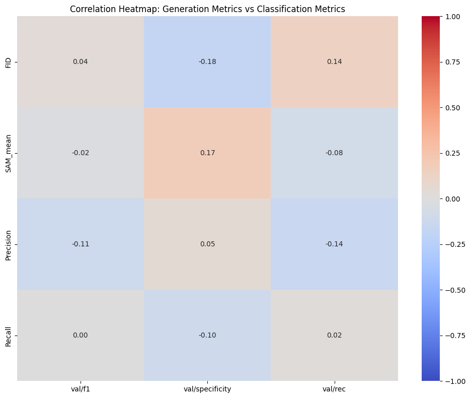
# Limitations
Our approach is limited by the small size and narrow diversity of the available hyperspectral melanoma dataset. Because the training set contains relatively few examples,  with limited variation in lesion shape, texture, and spectral patterns, the generative models end up learning a restricted and more specific distribution. As a result, the synthetic images tend to replicate the biases present in the training set rather than representing the broader variability of real-world skin lesions true distribution of our class.

When these synthetic images are added to the classifier’s training set, they reinforce the same dataset biases, improving performance on the validation subset, which comes from the same distribution as the training data. However, the classifier’s performance drops on the independent test set, showing that the synthetic data does not improve generalization. Lastly, another limitation is that all experiments were performed on a single hyperspectral dataset, so the findings are not yet validated across different acquisition systems and populations.
# Future Work

Future improvements to this project can focus on enhancing spectral realism experimenting different loss functions, improving classifier robustness, and validating the generality of the results:

- Use SAM as a loss function: Since the classifiers that performed best were trained with synthetic data showing the lowest SAM values, Spectral Angle Mapper can be integrated directly into the generator loss to penalize spectral distortion and improve spectral fidelity.

- Explore additional hyperspectral losses: To better preserve the shape and structure of hyperspectral signatures, other spectral-aware losses can be incorporated into model training, such as:  
  - SID (Spectral Information Divergence): measures divergence between spectra and captures nonlinear distortions.  
  - Hybrid Loss: Combines Spectral loss such as SAD, and spatial loss such as MSE, to improve both information regarding HSI images

- Evaluate generalization across datasets: The entire pipeline of generation, augmentation, and classification should be tested on additional hyperspectral skin-lesion datasets to assess whether synthetic data improves generalization.

- Apply explainability methods to hyperspectral classifiers: Using techniques such as Grad-CAM, Integrated Gradients, or spectral relevance maps can reveal which wavelengths are most important for melanoma classification. This may show whether hyperspectral imaging provides diagnostic information not captured by RGB and whether synthetic images preserve these important spectral cues.

<!-- # Conclusion
Our results show that classifiers trained with synthetic hyperspectral data perform better than those relying only on standard data augmentation or regularization. Adding GAN-generated melanoma images helped the models generalize better and improved sensitivity, especially for underrepresented classes. We also found that architectures built for high-resolution image generation, like FastGAN, work better than those designed specifically for hyperspectral synthesis—likely because our dataset has higher spatial resolution (256×256) and fewer spectral channels than typical HSI data. Overall, GANs outperformed VAEs on small, high-resolution datasets, producing sharper and more realistic lesion details.
Next, we plan to test classification models trained purely on synthetic data against real samples, use large RGB skin lesion datasets to generate more diverse images, and explore CycleGAN and pretraining strategies to improve realism. Conditioning FastGAN on RGB images or binary masks may also help control lesion structure and further boost the quality of generated hyperspectral data. -->

# Conclusion

Our experiments demonstrate that synthetic hyperspectral data does help improve melanoma classification, especially when the available real dataset is small. Across multiple architectures and training setups, adding synthetic melanoma images consistently improved validation F1-score, recall, and balanced accuracy compared to training with real data alone. This confirms our main hypothesis, which is classifiers benefit from a combination of real and synthetic hyperspectral samples.

Regarding RGB information, our results show that conditioning the generative models on RGB images did not yield better classifiers than unconditioned hyperspectral generation. SPADE FastGAN and CycleGAN, guided by RGB performed similarly or worse than the unconditioned FastGAN. This suggests that RGB images do not provide additional useful cues for hyperspectral synthesis in this specific task.

Similarly, using a classifier pretrained on large-scale RGB datasets (ImageNet) or on RGB melanoma images (ISIC) did not lead to substantial improvements over training from scratch. Although pretrained models converged faster, they did not surpass the DenseNet201 trained directly on hyperspectral data augmented with synthetic samples. This indicates that RGB-based pretraining does not transfer effectively to hyperspectral melanoma classification, likely due to modality mismatch.

Among all generative models tested, FastGAN produced the best synthetic hyperspectral data, while the best real-data baseline model was DenseNet201 trained without any synthetic augmentation. Importantly, we observed that classification performance was strongly linked to the SAM metric: the best classifiers were trained with synthetic datasets that achieved the lowest SAM, meaning the highest spectral fidelity. This suggests that spectral quality is the most relevant factor for improving downstream melanoma detection. The relationship between SAM and classifier performance also supports the idea that HSI contains meaningful information that RGB images cannot capture, and that preserving spectral structure is crucial for producing useful synthetic data.

Finally, our results show that it is possible to improve a melanoma classifier even with very limited real hyperspectral data, reinforcing the promise of generative models as a strategy for data augmentation in hyperspectral medical imaging. However, despite achieving better validation performance, the classifier trained with synthetic data did not outperform the baseline on the independent test set, yielding the need for larger datasets to ensure that better generalization on unseen data

## Bibliographic References
1. D. A. Abuhani, I. Zualkernan, R. Aldamani and M. Alshafai, "Generative Artificial Intelligence for Hyperspectral Sensor Data: A Review," in IEEE Journal of Selected Topics in Applied Earth Observations and Remote Sensing, vol. 18, pp. 6422-6439, 2025, doi: https://doi.org/10.1109/JSTARS.2025.3538759.
2. Palsson, Burkni, Magnus O. Ulfarsson, and Johannes R. Sveinsson. 2023. "Synthesis of Synthetic Hyperspectral Images with Controllable Spectral Variability Using a Generative Adversarial Network" Remote Sensing 15, no. 16: 3919. https://doi.org/10.3390/rs15163919
3. Liu, J., Wu, Z., Xiao, L., & Wu, X. J. (2022). Model Inspired Autoencoder for Unsupervised Hyperspectral Image Super-Resolution. IEEE Transactions on Geoscience and Remote Sensing, 60, 1-12. https://doi.org/10.1109/tgrs.2022.3143156
4. L. Zhu, Y. Chen, P. Ghamisi and J. A. Benediktsson, "Generative Adversarial Networks for Hyperspectral Image Classification," in IEEE Transactions on Geoscience and Remote Sensing, vol. 56, no. 9, pp. 5046-5063, Sept. 2018, doi: 10.1109/TGRS.2018.2805286.
5. J. Hauser, G. Shtendel, A. Zeligman, A. Averbuch and M. Nathan, "SHS-GAN: Synthetic Enhancement of a Natural Hyperspectral Database," in IEEE Transactions on Computational Imaging, vol. 7, pp. 505-517, 2021, doi: 10.1109/TCI.2021.3079818.
6. B. Liu, Y. Zhu, K. Song, and A. Elgammal, "Towards Faster and Stabilized GAN Training for High-Fidelity Few-Shot Image Synthesis," arXiv preprint arXiv:2101.04775, 2021. Available: https://arxiv.org/abs/2101.04775.

7. Tschandl P., Rosendahl C. & Kittler H. The HAM10000 dataset, a large collection of multi-source dermatoscopic images of common pigmented skin lesions. Sci. Data 5, 180161 doi.10.1038/sdata.2018.161 (2018)

8. Noel C. F. Codella, David Gutman, M. Emre Celebi, Brian Helba, Michael A. Marchetti, Stephen W. Dusza, Aadi Kalloo, Konstantinos Liopyris, Nabin Mishra, Harald Kittler, Allan Halpern: "Skin Lesion Analysis Toward Melanoma Detection: A Challenge at the 2017 International Symposium on Biomedical Imaging (ISBI), Hosted by the International Skin Imaging Collaboration (ISIC)", 2017; arXiv:1710.05006.

9. Hernández-Pérez C, Combalia M, Podlipnik S, Codella NC, Rotemberg V, Halpern AC, Reiter O, Carrera C, Barreiro A, Helba B, Puig S, Vilaplana V, Malvehy J. BCN20000: Dermoscopic lesions in the wild. Scientific Data. 2024 Jun 17;11(1):641.

10. MILK study team. MILK10k. ISIC Archive, 2025, doi:10.34970/648456.

11. i-pan. kaggle-melanoma. GitHub, https://github.com/i-pan/kaggle-melanoma. Accessed 24 Nov. 2025.

12. Park, T., Liu, M.-Y., Wang, T.-C., & Zhu, J.-Y. (2019). Semantic Image Synthesis with Spatially-Adaptive Normalization. In Proceedings of the IEEE Conference on Computer Vision and Pattern Recognition (CVPR).

13. Zhu, J.-Y., Park, T., Isola, P., & Efros, A. A. (2020). Unpaired Image-to-Image Translation using Cycle-Consistent Adversarial Networks. arXiv preprint arXiv:1703.10593.

