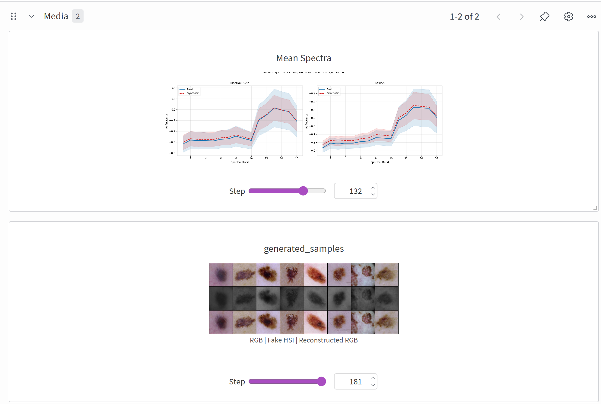
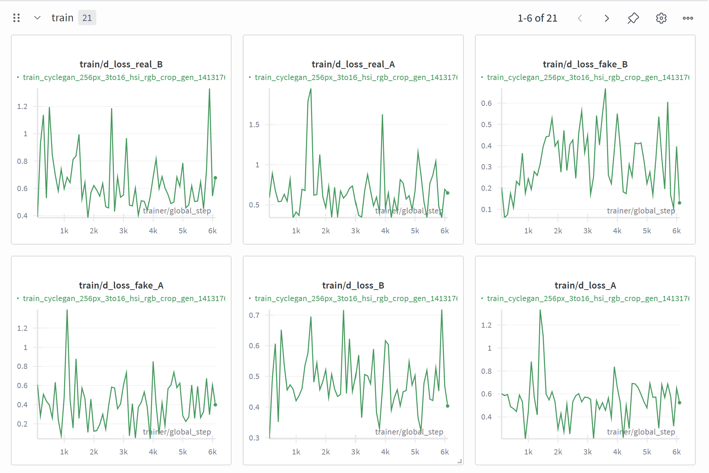
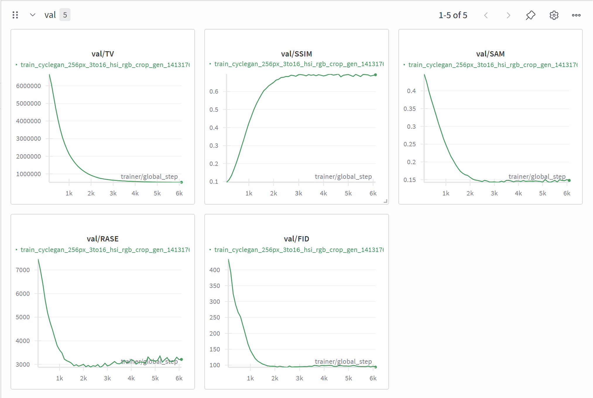

<div align="center">

# Reproductability of Hyperskin project
</div>

## Introduction
The Hyperskin project provides a complete, modular, and reproducible pipeline for generating and classifying hyperspectral dermoscopy images.
It integrates multiple generative models—CycleGAN, FastGAN, SHSGAN, VAE—and a set of classification models designed to distinguish melanoma from dysplastic nevi, enabling systematic evaluation of how synthetic data influences classification performance.

This repository is organized around fully configurable experiments using Hydra, PyTorch Lightning, and a clean directory structure that separates data modules, model definitions, training scripts, and experiment logs.
All experiments (generation and classification) can be reproduced exactly as reported

### File Structure

```text
├── configs                  # Configuration files
│   ├── data                 # Dataset configuration of HSI and RGB for different tasks (GENERATION and CLASSIFICATION)
│   │   └── hsi_dermoscopy_aug.yaml     
│   │   └── joint_rgb_hsi_dermoscopy.yaml   
│   ├── model                # Model  configuration for different models (FastGAN, CycleGAN, VAE, SHSGAN)configuration
│   │   └── hsi_cycle_gan.yaml  
│   └── default.yaml         # Default configuration
├── data   # Dataset directory    
│   ├── hsi_dermoscopy       #This is automatically extracted from google drive when calling main.py
│   ├── splits #train, val, test split
├── logs   
│   ├── hypersynth           #This is where the checkpoints .cpkt are saved!
│   ├── wandb #Wandb configuration files
directory
├── notebooks                # Jupyter Notebook directory
├── scripts                  # Auxilary functions for dataset preparation and model evaluation directory
│   └── clear_wandb_cache.py # Example script to clear wandb cache
├── src   # Source code directory
│   ├── callbacks            # Callbacks directory
│   │   └── __init__.py
│   ├── data_modules         # Data module directory
│   │   ├── __init__.py
│   │   └── mnist.py         # Example data module for MNIST dataset
│   ├── metrics              # Metrics directory
│   │   └── __init__.py
│   ├── models               # Model directory
│   │   ├── __init__.py
│   │   └── cycle_gan   
│   │   └── fastgan 
│   │   └── vae
│   ├── modules              # Module directory
│   │   ├── __init__.py
│   │   └── generative
│   │   │   └── gan
│   │   │   │   └── cycle_gan.py
│   │   │   │   └── shs_gan.py
│   │   │   │   └── fastgan  #Directory
│   ├── utils                # Utility directory
│   │   ├── __init__.py
│   │   └── cli.py           # CLI tool
│   ├── __init__.py
│   └── main.py              # Main program entry point
├── .env.example             # Example environment variable file
├── .gitignore               # Ignore files for git
├── .project-root            # Project root indicator file for pyrootutils
├── LICENSE                  # Open source license
├── pyproject.toml           # Configuration file for Black and Ruff
├── README.md                # Project documentation

```

## Usage

### Installation

```bash
# Clone project
git clone https://github.com/krisandre7/dgm-2025.2.git
cd hyperskin

# [Optional] Create a conda virtual environment
conda create -n hyperskin python=<3.11>
conda activate hyperskin

# [Optional] Use mamba instead of conda to speed up
conda install mamba -n base -c conda-forge

# [Optional] Install PyTorch according to the website to get GPU support
# https://pytorch.org/get-started/

# Install dependencies
pip install -r requirements.txt
```
## Weights & Biases (W&B) Experiment Tracking

This project uses **Weights & Biases (W&B)** to track training runs, store checkpoints, visualize metrics, and ensure full reproducibility. W&B collects information automatically during training, including model losses, evaluation metrics, hyperparameters, and generated synthetic samples.

W&B allows you to monitor the entire training process in real time. You can view curves for generator, discriminator and classifier losses, as well as validation metrics such as SAM, PSNR, SSIM and FID. It also stores the exact `.yaml` configuration used for each run, which makes it easy to reproduce your experiment or compare different models and hyperparameters. Depending on the module being trained, W&B also displays synthetic images, spectral bands and other visual outputs generated during training.

To use W&B, first create a free account at https://wandb.ai and install it using `pip install wandb`. Then log in by running `wandb login`. Training will automatically start logging to your W&B account as long as your entity and project are correctly defined in the configuration file.

To configure W&B for this repository, open the model configuration file:

```bash
cd projects/hyperskin/configs/model/<model>.yaml
```
Inside the file, locate the W&B fields:
```bash
entity: k298976-unicamp
project: hypersynth
```
### Run

**Fit**

1. Training Generation Model

```bash
# CycleGAN
python src/main.py fit \
    -c configs/data/joint_rgb_hsi_dermoscopy.yaml \
    -c configs/model/hsi_cycle_gan.yaml
# FastGAN
python src/main.py fit \
    -c configs/data/hsi_dermoscopy_croppedv2.yaml \
    -c configs/model/hsi_fastgan.yaml
# VAE
python src/main.py fit \
    -c configs/data/hsi_dermoscopy_croppedv2_vae.yaml \
    -c configs/model/vae.yaml
# SHSGAN
python src/main.py fit \
    -c configs/data/hsi_dermoscopy_croppedv2.yaml \
    -c configs/model/shs_wgan.yaml

```
There are some files inside each config folders that were part of experiments for optimizing each trainment, so we tested different configurations of normalization and conditioning techniques that modified the configuration .yaml. But feel free to try them out and just check which model it is importing on the class_path

During training the logs are saved on the wandb environment. To setup this environment access the following path:
```bash
cd projects/hyperskin/configs/model/<model>.yaml
```
Access the line
      entity: k298976-unicamp
      project: hypersynth
Ans modify according to the entity and project set in your account.
Once you access wandb, you can visualize logs related to the lossess of the classifier, generator, discriminator. Evaluation metrics along each step such as SAM, PSNR, FID and SSIM, the configuration you used in this training in .yaml and depending on the module you can acess the generated synthetic data and the spectral band as well.


Replace these with the entity and project names associated with your W&B account. After this setup, every executed training run will appear in your W&B workspace, showing all relevant logs, metrics, configurations, and generated samples.

Below are examples of the visualizations you will find on the W&B dashboard:

<p align="center">    </p>

2. Training Classification Model

The classification models classifies between melanoma and dysplastic nevi. We can test this with or without the synthetic data obtained from our generation model in "1". To test the usability of our synthetic data, you can experiment different configurations of trainings

- Full train: Use synthetic data exclusively for training.
- Mixed train: Use synthetic data to complement real training data.
- Full validation: Use synthetic data exclusively for validation.
```bash
# Without synthetic data
python src/main.py fit \
    -c configs/data/hsi_dermoscopy_croppedv2.yaml \
    -c configs/model/hsi_classifier_densenet201_best.yaml

# Full train
python src/main.py fit \
    -c configs/data/hsi_dermoscopy_train-synth.yaml \
    -c configs/model/hsi_classifier_densenet201_best.yaml

# Full validation
python src/main.py fit \
    -c configs/data/hsi_dermoscopy_val-synth.yaml \
    -c configs/model/hsi_classifier_densenet201_best.yaml

# Mixed train
python src/main.py fit \
    -c configs/data/hsi_dermoscopy_mixed-train03.yaml \
    -c configs/model/hsi_classifier_densenet201_best.yaml

```

**Validate**

```bash
# Example
python src/main.py validate \
    -c logs/hypersynth/lk6elvbc/config.yaml \
    --ckpt_path logs/hypersynth/lk6elvbc/checkpoints/epoch=00-val_acc=0.1450.ckpt
```

**Test**

```bash
# Example
python src/main.py test \
    -c logs/hypersynth/lk6elvbc/config.yaml \
    --ckpt_path logs/hypersynth/lk6elvbc/checkpoints/epoch=00-val_acc=0.1450.ckpt
```

**Inference**

```bash
# Example: replace the ckpt_path with the desired checkpoint you wish to use during inference
WANDB_MODE=disabled python src/main.py predict \
    -c logs/hypersynth/16ztzy8j/config.yaml \
    --ckpt_path logs/hypersynth/16ztzy8j/checkpoints/step=0-val_FID=86.3025.ckpt \
    --trainer.logger=false \
    --data.init_args.rgb_only=true \
    --model.init_args.pred_hyperspectral=true \
    --data.init_args.pred_num_samples=100
```

**Debug**

```bash
python src/main.py fit \
    -c configs/data/mnist.yaml \
    -c configs/model/simplenet.yaml \
    --trainer.fast_dev_run true
```

**Resume**

```bash
python src/main.py fit \
    -c configs/data/mnist.yaml \
    -c configs/model/simplenet.yaml \
    --ckpt_path <path_to_checkpoint.ckpt> \
    --trainer.logger.id exp1_id
```

### Checkpoints Download

Here are the checkpoints for the best outcomes for generative and classification models:

* Generation:
1. Auxilary Conditioned Melanoma Cycle GAN (AC-CycleGAN): [Checkpoints- Google Drive](https://drive.google.com/drive/folders/10NpP6RYzdon9n757iGszPVemZVMTLz-u?usp=drive_link)
2. Cycle GAN to generate melanoma: [Checkpoints- Google Drive](https://drive.google.com/drive/folders/1wUvne5ERN7_edehDOTzrRdhdoMVdebBT?usp=drive_link)
3. Fast GAN  to generate melanoma class: [Checkpoints- Google Drive](https://drive.google.com/drive/folders/1p8Uy1o7bkhv-hqut-tnL8GiNOaP2T69k?usp=drive_link)
4. Fast GAN to generate nevi class: [Checkpoints- Google Drive](https://drive.google.com/drive/folders/1jLnQjC0BMR5cyFNNzqaEQjy_cYSj010l?usp=drive_link)

* Classification:
1. Baseline (no synthetic data): [Checkpoints- Google Drive](https://drive.google.com/drive/folders/1coBazkR-tDqxt5eg1NPK0pQ32bDQ6qIl?usp=drive_link)
1. Pre-trained Baseline (no synthetic data): [Checkpoints- Google Drive](https://drive.google.com/drive/folders/1IiG0fkHCI3aAmVjpZtM0aLIwLbLc-uXC?usp=drive_link)
2. Synthetic AC-CycleGAN: [Checkpoints- Google Drive](https://drive.google.com/drive/folders/1kzXozVLRpokERdczqo4_mELa6MpxhNvw?usp=drive_link)
3. Synthetic Pre-trained Cycle-GAN: [Checkpoints- Google Drive](https://drive.google.com/drive/folders/1ogExdpIucSxwIGld0SYyhxMNfM0WDg5B?usp=drive_link)
4. Synthetic Cycle-GAN: [Checkpoints- Google Drive](https://drive.google.com/drive/folders/10NpP6RYzdon9n757iGszPVemZVMTLz-u?usp=drive_link)
5. Synthetic FastGAN: [Checkpoints- Google Drive](https://drive.google.com/drive/folders/1BWaynzX3hcwrmhAmV4drDOq5I32Bvoel?usp=drive_link)
6. Synthetic Pre-trained FastGAN: [Checkpoints- Google Drive](https://drive.google.com/drive/folders/1znTJX7DEehlJGVefTIAaJq_QpdrfE-sJ?usp=drive_link)
7. Synthetic Pre-trained SPADE FastGAN: [Checkpoints- Google Drive](https://drive.google.com/drive/folders/1rS5ZPut49Qk2umA-Mv-RtpyQIZBLnqWj?usp=drive_link)
