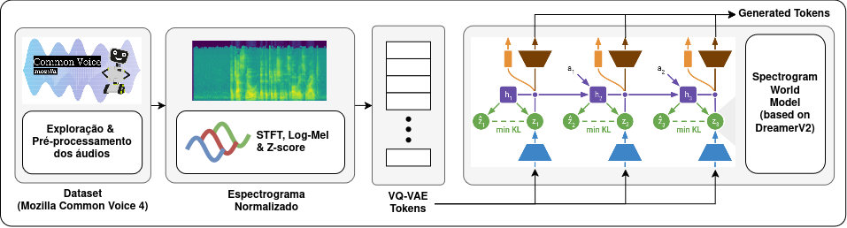

# `Análise de Sinais de Áudio com Modelos de Mundo`
# `Audio Signal Analysis with World Models`

## Apresentação

Este projeto teve origem no contexto do curso de pós-graduação IA376N - IA Generativa: dos modelos às aplicações multimodais, oferecido no segundo semestre de 2025, na Unicamp, sob a orientação da Prof.ª Dra. Paula Dornhofer Paro Costa, do Departamento de Engenharia da Computação e Automação (DCA) da Faculdade de Engenharia Elétrica e de Computação (FEEC).

|Nome  | RA | Especialização|
|--|--|--|
| Davi Pincinato  | 157810  | Eng. Computação |
| Henrique Parede de Souza  | 260497  | Eng. Computação|
| Isadora Minuzzi Vieira  | 290184  | Eng. Biomédica|
| Raphael Carvalho da Silva e Silva  | 205125  | Eng. Computação |

## Resumo (parcial E2)

Este projeto propõe adaptar modelos de mundo (World Models) à tarefa de síntese de áudio por meio de “sonhos”, tendo como base a arquitetura DreamerV2, originalmente desenvolvida para aprendizado de políticas em ambientes como o Atari. A ideia central é que a mesma estrutura que permite ao Dreamer aprender e planejar em espaços latentes pode ser explorada para modelar a dinâmica temporal de sinais sonoros. A partir de espectrogramas de áudios, treinamos um VQ-VAE para discretizar os espectrogramas, em seguida, um modelo de mundo com RSSM com estados determinísticos e estocásticos discretos para capturar suas dependências temporais. Na Etapa 2 (E2), concluímos o pré-processamento, o treinamento do VQ-VAE e iniciamos o treinamento conjunto de encoder, RSSM e decoder com perdas de reconstrução e divergência KL. Resultados parciais mostram reconstruções consistentes e uso estável do codebook, evidenciando o potencial do paradigma de World Models para geração de áudio coerente a partir de representações latentes aprendidas, análogo ao modo como o Dreamer aprende dinâmicas visuais em jogos do Atari.

## Descrição do projeto
Modelos de mundo (World Models) surgiram da área de aprendizado por reforço (RL) como uma forma de aprender representações latentes das dinâmicas do ambiente [HA et al. (2018)]. Ao invés de reagir apenas a observações imediatas, um modelo de mundo aprende a prever e “imaginar” futuros estados no seu próprio espaço latente, permitindo planejar e aprender políticas de forma mais eficiente.

Entre esses modelos, as arquiteturas Dreamer e DreamerV2 [HAFNER et al. (2020)] se destacam ao combinar um modelo de mundo latente com aprendizado de políticas inteiramente nesse espaço, dispensando a reconstrução pixel a pixel das observações visuais. Enquanto o Dreamer se destaca ao aprender comportamentos em ambientes de jogos complexos, como o Atari, usando representações discretas de estados latentes, o DreamerV2 estende essa ideia combinando a representação discreta com um objetivo de aprendizado livre de reconstrução.

Neste projeto, propomos transportar o conceito de modelos de mundo para o domínio do áudio, buscando explorar sua capacidade de previsão, completude de sequências (por exemplo, “ba-ta” → “ta”), síntese condicionada, robustez em reconhecimento automático de fala (ASR) e aprendizado self-supervised. Assim como o DreamerV2 aprende a prever e planejar em espaços latentes no domínio visual, nossa proposta visa desenvolver um modelo capaz de aprender representações latentes e dinâmicas temporais de sinais de áudio.

A principal adaptação consiste em substituir as imagens de jogos pelos espectrogramas de áudio, e em discretizar esses espectrogramas em tokens, tornando as sequências resultantes compatíveis com arquiteturas temporais baseadas em atenção e objetivos contrastivos. Essa tokenização elimina a necessidade de reconstrução direta do sinal espectral, reduzindo custos computacionais e favorecendo a escalabilidade e eficiência do treinamento. Dessa forma, o modelo pode aprender a capturar as estruturas e transições subjacentes dos sons, abrindo caminho para representações mais ricas e generalizáveis no aprendizado de áudio.

## Objetivos
O objetivo geral deste projeto consiste no treino um modelo de mundo para espectrogramas de áudio capaz de prever/imaginar a evolução de espectrogramas tokenizados. Para o cumprimento deste objetivo, são instanciados os seguintes objetivos específicos:

- Definição de dataset e pré-processamento, incluindo separação de amostras de áudio não validadas e transformação para espectrogramas.
- Proposta e implementação de um modelo VQ-VAE [OORD et al. (2017)] para tokenização dos espectrogramas de áudio.
- Treinamento do modelo de mundo (encoder + RSSM com estados discretos + decoder) para reconstrução/likelihood sobre tokens.
- Definir métricas para qualidade de tokenização, uso do codebook e compreender a capacidade preditiva do world model.
- Investigar objetivo contrastivo (sem reconstrução explícita) e integração do ator-crítico ao estado latente (DreamerV2).

## Metodologia
A metodologia para adaptar o Dreaming V2 para dados de áudio envolverá as seguintes etapas:

### 1. Pré-processamento de Áudio:

- Converter os arquivos de áudio brutos em espectrogramas utilizando a Transformada de Fourier de Curto Tempo (STFT): 
    - Esta técnica decompõe o sinal temporal em representações tempo-frequência, permitindo capturar tanto a evolução temporal quanto o conteúdo espectral do áudio.
    - A STFT é especialmente adequada para este projeto pois mantém a localização temporal das características acústicas, facilitando o aprendizado de dependências sequenciais pelo RSSM.
    - Implementado utilizando `torchaudio` e `librosa`.

- Normalizar e pré-processar os espectrogramas para que sejam compatíveis com a entrada do modelo VQ-VAE: 
    - **Conversão para escala log-mel**: Transformação para escala mel (que aproxima a percepção auditiva humana) e aplicação de logaritmo para comprimir a faixa dinâmica, tornando características sutis mais visíveis ao modelo.
    - **Normalização de amplitude**: Aplicação de normalização z-score para cada amostra individualmente, para garantir que os valores do espectrograma estejam em uma faixa adequada, evitando problemas de convergência durante o treinamento.

- Divisão dos espectrogramas com proporções 80% treino / 10% validação / 10% teste, garantindo que não haja vazamento entre conjuntos.

- Avaliação preliminar dos espectrogramas gerados:
    - **Visualização dos Espectrogramas gerados**: Plotagem de espectrogramas log-mel usando `matplotlib`.
    - **Reconstrução do Áudio**: Aplicação da transformada inversa (Griffin-Lim) para converter espectrogramas de volta ao domínio temporal, permitindo avaliação perceptual da qualidade do pré-processamento. Verificação de que o áudio reconstruído mantém inteligibilidade e características do original.

### 2. Tokenização do Espectrograma:

- Treinamento do VQ-VAE para tokenização dos espectrogramas utilizando as divisões de treino e validação:

    - O VQ-VAE aprende um codebook discreto que mapeia regiões contínuas do espaço latente em índices discretos, permitindo representar espectrogramas como sequências de tokens.

    - Esta abordagem é especialmente adequada pois: 
        - Reduz a dimensionalidade dos dados mantendo informação perceptualmente relevante.
        - Cria representações discretas compatíveis com modelos de sequência como o RSSM.

    - A arquitetura consistirá de um encoder convolucional que comprime o espectrograma em vetores latentes, uma camada de quantização vetorial que mapeia esses vetores para o codebook discreto, e um decoder convolucional que reconstrói o espectrograma a partir dos códigos.

    - Implementado utilizando `PyTorch` com funções de perda compostas por: reconstrução (MSE ou perceptual loss), commitment loss (para aproximar encoder ao codebook) e codebook loss (para atualizar os vetores do codebook).

- Aplicação do modelo VQ-VAE treinado para tokenizar separadamente os conjuntos de treino, validação e teste.

- Avaliação da qualidade da tokenização:
    - **Qualidade de Reconstrução**: Cálculo de métricas quantitativas (MSE, PSNR, Correlação de Pearson) entre espectrogramas originais e reconstruídos.
    - **Utilização do Codebook**: Análise da distribuição de uso dos códigos do codebook para verificar se há collapse (códigos não utilizados) ou se há diversidade adequada. Idealmente, todos os códigos devem ser utilizados com frequência razoável.

### 3. Arquitetura do Modelo de Mundo:

- Implementação da arquitetura baseada no Recurrent State Space Model (RSSM) para aprender dinâmicas temporais dos espectrogramas tokenizados:
    - O RSSM combina estados latentes determinísticos (capturados por uma GRU/LSTM) e estocásticos (variáveis categóricas discretas) para modelar sequências com incerteza, análogo ao DreamerV2.
    - Esta arquitetura é especialmente adequada pois:
        - Permite capturar dependências temporais de longo prazo através do estado determinístico recorrente.
        - Modela a estocasticidade inerente aos sinais de áudio através de estados discretos probabilísticos.
        - Facilita o planejamento e imaginação de trajetórias futuras inteiramente no espaço latente.

- Definição dos componentes do modelo de mundo, com base na implementação do repositório `pydreamer`:
    - **Encoder**: Rede neural que combina MLP e camadas convolucionais 1D, mapeando sequências de tokens do VQ-VAE para embeddings contínuos que alimentam o RSSM.
    - **RSSM**: Núcleo do modelo de mundo composto por três sub-módulos interconectados:
        - *Modelo de Representação*: Infere o estado estocástico atual $z_t$ combinando a observação atual com o estado determinístico $h_t$ via distribuições categóricas.
        - *Modelo de Transição*: Prediz o próximo estado estocástico $\hat{z}_{t+1}$ usando apenas $h_t$, permitindo imaginação sem observações reais.
        - *Modelo Dinâmico (GRU)*: Atualiza o estado determinístico $h_{t+1}$ a partir de $h_t$ e $z_t$, capturando memória temporal de longo prazo.
    - **Decoder**: Reconstrói a distribuição sobre tokens a partir do estado latente $(h_t, z_t)$, permitindo calcular a verossimilhança das observações.

- Treinamento conjunto do modelo de mundo utilizando sequências tokenizadas do conjunto de treino:
    - **Função de Perda de Reconstrução**: Negative log-likelihood (NLL) ou cross-entropy entre tokens preditos e observados, medindo a capacidade do modelo de prever observações.
    - **Divergência KL**: Regularização entre distribuições do modelo de representação e transição, incentivando o modelo de transição a prever estados consistentes sem depender de observações.

- Avaliação da capacidade preditiva do modelo de mundo (parcialmente implementado na E2):
    - **Perda de Reconstrução**: Monitoramento da NLL no conjunto de validação para verificar se o modelo generaliza além do treino.
    - **Qualidade de Imaginação**: Geração de sequências de tokens através de rollouts imaginados (usando apenas o modelo de transição) e avaliação da coerência via reconstrução de áudio.
    - **Análise de Estados Latentes**: Visualização de trajetórias no espaço latente (t-SNE/UMAP) para verificar se estruturas temporais e fonéticas são capturadas de forma interpretável.
    - **Divergência KL**: Análise do balanço entre KL e reconstrução para garantir que o modelo não collapse para priors triviais nem ignore estados latentes.

### 4. Aprendizado de Comportamento e Síntese (E3 - Planejado):

- Implementação do módulo de aprendizado por reforço (Actor-Critic) para completar a arquitetura DreamerV2, com base na implementação do repositório `pydreamer`:
    - O ator (policy network) aprenderá a gerar "ações" (ou transições temporais) que produzam sequências de áudio coerentes e semanticamente significativas.
    - O crítico (value network) estimará o valor esperado de estados latentes, permitindo ao ator otimizar para objetivos de longo prazo (ex: maximizar coerência temporal, diversidade fonética, ou fidelidade a condicionantes).
    - Esta abordagem permite que o modelo não apenas preveja passivamente, mas planeje ativamente sequências de áudio desejáveis, explorando o espaço latente de forma direcionada.
    - Implementação com algoritmos de policy gradient (PPO, A2C ou A3C) adaptados para o domínio contínuo de áudio.

- Treinamento do ator-crítico inteiramente no espaço latente (imagination):
    - Geração de rollouts imaginados usando apenas o modelo de transição do RSSM, sem necessidade de interação com dados reais durante esta fase.
    - Cálculo de retornos e vantagens a partir das estimativas do crítico para atualizar a política do ator.
    - Treinamento alternado entre modelo de mundo (seção 3) e ator-crítico, com possibilidade de fine-tuning conjunto.

- Síntese de áudio através de planejamento latente:
    - **Geração Não-Condicionada**: Amostragem de estados iniciais do prior e rollout através do ator para produzir sequências de tokens, seguido de decodificação via VQ-VAE e reconstrução de áudio.
    - **Geração Condicionada**: Uso de embeddings de condicionamento (texto, classe de som, emoção) para guiar o planejamento e gerar áudio alinhado a especificações.
    - **Completude de Sequências**: Dada uma sequência parcial de áudio (ex: "ba-ta" → ?), o modelo imagina continuações plausíveis explorando o espaço latente.
    - **Interpolação Latente**: Navegação suave entre diferentes estados acústicos para gerar transições morfológicas entre sons.

- Implementação de objetivo contrastivo:
    - Substituição ou complementação do objetivo de reconstrução por aprendizado contrastivo, comparando pares positivos (estados consecutivos reais) e negativos (estados não relacionados).
    - Esta abordagem reduz a dependência de reconstrução pixel-a-pixel (ou token-a-token), focando em aprender representações que capturam relações temporais abstratas.
    - Implementado utilizando losses como InfoNCE ou NT-Xent adaptadas para sequências temporais.

- Avaliação do sistema completo de síntese de áudio:
    - **Qualidade Perceptual**: Avaliação humana (MOS - Mean Opinion Score) ou métricas automáticas (PESQ, STOI, Fréchet Audio Distance) comparando áudios gerados com reais.
    - **Coerência Temporal**: Análise de continuidade espectral e ausência de artefatos audíveis (cliques, descontinuidades).
    - **Diversidade e Cobertura**: Verificação de que o modelo explora adequadamente o espaço acústico sem modo collapse, usando métricas como coverage e inception score adaptadas para áudio.
    - **Alinhamento Condicional**: Quando aplicável, validação de que gerações condicionadas correspondem aos atributos especificados (precisão de classificação, correlação semântica).
    - **Capacidade de Planejamento**: Testes de completude de sequências e interpolação, avaliando se o modelo "imagina" futuros plausíveis e semanticamente coerentes.

### Datasets and Evolution

|Dataset | Web Address | Descriptive Summary|
|----- | ----- | -----|
| Common Voice Dataset Version 4 | https://www.kaggle.com/datasets/vedant2022/common-voice-dataset-version-4 | Dataset de fala em inglês composto por gravações de áudio validadas por crowdsourcing. Utilizado para treinar modelos de reconhecimento de fala e síntese de voz. Contém aproximadamente 889 horas validadas, com metadados incluindo texto transcrito, idade, gênero e sotaque dos falantes. Ideal para aprendizado self-supervised de representações acústicas devido à diversidade fonética e variabilidade de locutores.|

- Resumo do preparo do dataset
    - Para o filtro de comprimento, foram mantidas sequências com tokens ≥ 20, resultando em 652h33min de áudio válidas.
    - Foi feito o split do dataset em 80% para treino, 10% validação e 10% teste.
    - A formatação realizada para espectrogramas log-mel (n_mels=80), tokenização VQ-VAE (codebook=1024).

### Workflow (parcial E2)

Figura: Diagrama resumido do fluxo de pré-processamento, tokenização (VQ-VAE), treino do modelo de mundo (Encoder + RSSM + Decoder).

## Experiments, Results, and Discussion (parcial: E2)

### Tokenizador VQ-VAE.

- Treinamento por 10 épocas com batch_size=512 em GPU.
- Saídas parciais: PNGs comparando espectrogramas reais vs. reconstruídos; erros de reconstrução em queda ao longo das épocas; tokens coerentes visualmente ao reverter para o domínio espectrográfico.
- Achados preliminares: uso não-colapsado do codebook (observação qualitativa); próximos passos incluem medir perplexidade e entropia por código.

### World Model (Encoder + RSSM + Decoder).

- Treinamento conjunto iniciado com sequência de 20 passos; ações vazias (dinâmica intrínseca do sinal).
Objetivo: minimizar KL (prior vs. posterior) e reconstrução sobre tokens.
- Discussão: a KL mostrou-se essencial para estabilizar o prior e permitir imaginação (rollouts sem observação). Resultados quantitativos (CE/NLL por horizonte) serão apresentados na E3, bem como exemplos de completar uma sequência parcial (e.g:, “ba-ta”→“ta”).

## Decisões & ajustes de trajetória.

Manteremos a fase com reconstrução para consolidar métricas e depois testamos objetivo contrastivo (sem reconstrução) inspirado por literatura recente, para reduzir viés de pixel-matching e melhorar predição latente.

## Conclusion
Concluímos a etapa de pré-processamento, o treinamento do VQ-VAE e iniciamos o world model com RSSM discreto, obtendo reconstruções consistentes e dinâmica latente estável. 

Próximos passos (E3):
consolidar métricas (perplexidade/uso do codebook; NLL/CE por horizonte; distâncias espectrais),
demonstrar rollouts e completação de sequências,
testar objetivo contrastivo e comparar contra a abordagem com reconstrução,
publicar scripts, configs e logs para plena reprodutibilidade.

## Cronograma

Legenda: ▓ = duração da tarefa, ⭐ = entrega

| Fase de Trabalho       | Atividades Principais                           | 1 | 2 | 3 | 4 | 5 | 6 | 7 | 8 | 9 | 10 | 11 |
|------------------------|-------------------------------------------------|---|---|---|---|---|---|---|---|---|----|----|
| Preparação & Setup     | Setup do ambiente + revisão código              | ✅ |   |   |   |   |   |   |   |   |    |    |
| Pré-processamento      | Conversão áudio → espectrograma + normalização  |   | ✅ |   |   |   |   |   |   |   |    |    |
| Pré-processamento      | Tokenização (janelas → embeddings)              |   | ✅ | ✅ |   |   |   |   |   |   |    |    |
| Modelo de Mundo        | Encoder + RSSM (ajuste usando DreamerV2)    |   |   | ✅ | ✅ |   |   |   |   |   |    |    |
| Modelo de Mundo        | Integração do Decoder / avaliação básica        |   |   |   |   | ✅ |   |   |   |   |    |    |
| **Entrega Parcial**    | Status do projeto                               |   |   |   |   |   | ⭐ |   |   |   |    |    |
| Treinamento            | Execução com DreamerV2 + ajustes leves      |   |   |   |   |   |   | ▓ | ▓ |   |    |    |
| Avaliação & Ajustes    | Análise de métricas e resultados                |   |   |   |   |   |   |   | ▓ | ▓ |    |    |
| Documentação           | Relatório + notebooks + apresentação            |   |   |   |   |   |   |   |   | ▓ | ▓  |    |
| **Entrega Final**      | Refinamento, validação final e entrega          |   |   |   |   |   |   |   |   |   |    | ⭐  |

## Base de referência
Este projeto é baseado em duas referências principais:

#### 1. Artigo Acadêmico: ["Dreaming V2: Reinforcement Learning with Discrete World Models without Reconstruction"](https://arxiv.org/pdf/2203.00494).

**Principais contribuições/inspirações**: O artigo apresenta o Dreaming V2, uma extensão colaborativa do DreamerV2 e Dreaming. Ele adota a representação discreta do DreamerV2 e um objetivo livre de reconstrução do Dreaming. O modelo de mundo é treinado usando um aprendizado contrastivo, que elimina a necessidade de reconstruir observações visuais complexas. Os autores demonstraram que esta abordagem alcança resultados de última geração em tarefas de braços robóticos em 3D.

#### 2. Bases de Código para Implementação:
[dreamer-torch](https://github.com/jsikyoon/dreamer-torch): Implementação em PyTorch se assemelha ao código original do DreamerV2, que foi escrito em TensorFlow. É uma referência valiosa para entender a estrutura e a lógica do modelo em um framework amplamente utilizado na comunidade de pesquisa. Os resultados demonstraram desempenho similar ao do modelo original em tarefas de controle de jogos.

[pydreamer](https://github.com/jurgisp/pydreamer): Outra reimplementação do DreamerV2 em PyTorch, que introduz algumas diferenças sutis e melhorias, como o uso de processos separados para o trainer e os workers do ambiente, permitindo que o GPU seja utilizado totalmente. Esta base de código serve como um ponto de partida para explorar abordagens ligeiramente diferentes e otimizações.

## Tecnologias e bibliotecas utilizadas
**Linguagem**: Python

**Frameworks de Deep Learning**: PyTorch (conforme as bases de código de referência)

**Processamento de Áudio**: Librosa, Torchaudio

**Manipulação de Dados**: NumPy, Pandas

**Visualização**: Matplotlib, TensorBoard

## Links para a Apresentação
- E1
    - Link para o [vídeo da apresentação](https://drive.google.com/file/d/1IFhNwxeS_8Gce3WTqXLOq8UJDLKJB7QQ/view?usp=sharing).
    - Link para os [slides da apresentação](https://www.canva.com/design/DAGzF_vtvEE/6c1_5Sw-mUuLSqV6HMjP9Q/edit?utm_content=DAGzF_vtvEE&utm_campaign=designshare&utm_medium=link2&utm_source=sharebutton).
- E2
    - Link para o [drive](https://drive.google.com/drive/folders/1WRHc6uAdlA1_P8DQIelyknfx_SQ6PT8U?usp=sharing).

## Referências:
HA, David; SCHMIDHUBER, Jürgen. World Models. arXiv:1803.10122, 2018.
https://arxiv.org/abs/1803.10122

HAFNER, Danijar et al. DreamerV2: Mastering Atari with Discrete World Models. arXiv:2010.02193, 2020.
https://arxiv.org/abs/2010.02193

HAFNER, Danijar et al. Learning Latent Dynamics for Planning from Pixels (PlaNet). ICML, 2019.
https://arxiv.org/abs/1811.04551

OORD, Aaron van den et al. Neural Discrete Representation Learning (VQ-VAE). NeurIPS, 2017.
https://arxiv.org/abs/1711.00937

PRABHU, Kundan Kumar et al. Autoregressive Spectrogram Inpainting with Time–Frequency Transformers. arXiv preprint, 2021.
https://arxiv.org/abs/2104.03976

WANG, Yuxuan et al. Tacotron: Towards End-to-End Speech Synthesis. Interspeech, 2017.
https://arxiv.org/abs/1703.10135

PANAYOTOV, Vassil et al. LibriSpeech: An ASR Corpus. ICASSP, 2015.
https://www.openslr.org/12

Mozilla. Common Voice Dataset.
https://commonvoice.mozilla.org
