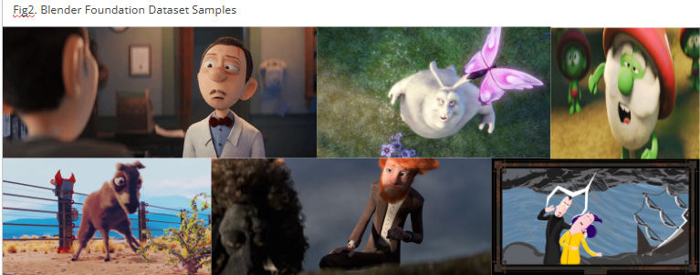
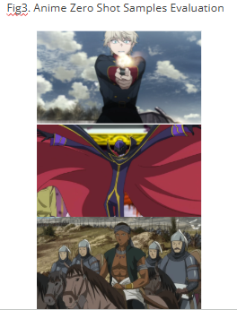
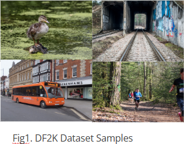
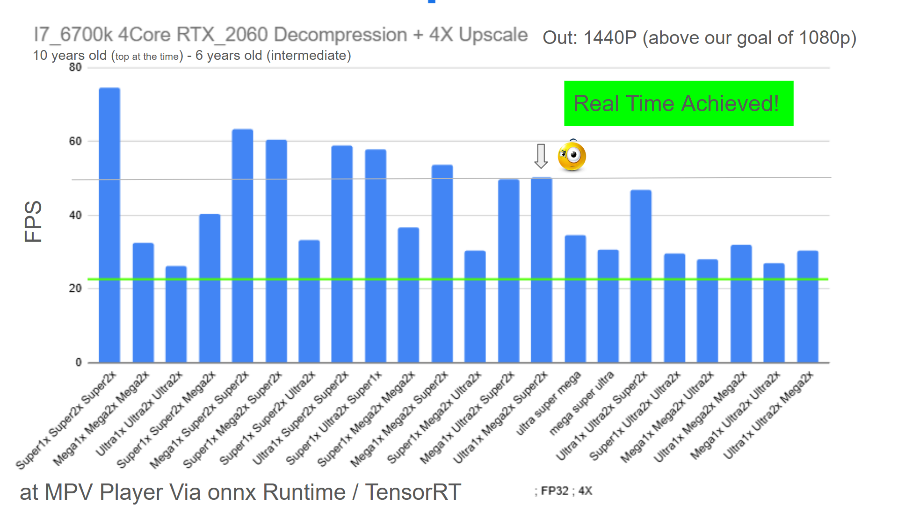
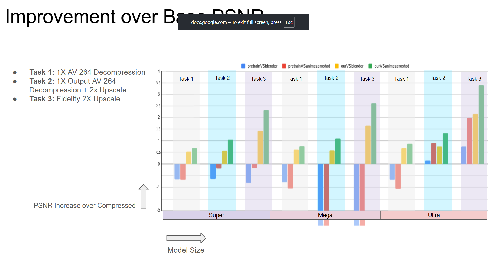
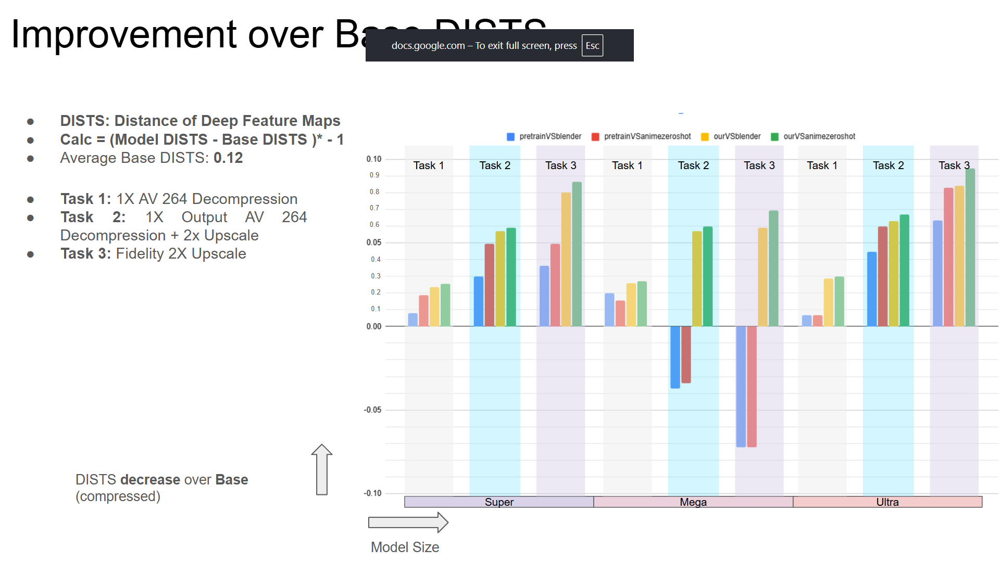

# `<Super Descompressão de Vídeo>`
# `<Super Video Decompression>`

## Presentation

This project originated in the context of the graduate course *IA376N - Generative AI: from models to multimodal applications*, 
offered in the second semester of 2025, at Unicamp, under the supervision of Prof. Dr. Paula Dornhofer Paro Costa, from the Department of Computer and Automation Engineering (DCA) of the School of Electrical and Computer Engineering (FEEC).

> |Name  | RA | Specialization|
> |--|--|--|
> | Fernando Barbosa Gomes  | 211503  | Computer Engineering|
> | Pedro Luis Rebollo  | 217460  | Computer Engineering|
> | Victor Manoel Rodrigues Guilherme  | 213307  | Computer Engineering|

## Importants Links

[Link to E1 presentation video](https://files.realmsapp.top/PresentationE1.mp4)

[Link to slideshow E1](https://docs.google.com/presentation/d/1TISrxtNkQHBbZlzTeAIGRFAGPHKGeUeE0Cg3LDZzKp4/edit?usp=sharing)

## Project Summary Description
Today, nearly 80% of global internet bandwidth is consumed by video streaming. Of this total, around 90% of the content is delivered in 1080p resolution or lower, through platforms such as Twitch.tv, YouTube, Netflix, Disney+, and Hulu. To make large-scale distribution feasible, most videos are compressed using lossy algorithms like H.264/AVC. While this approach is effective in reducing file size, it inevitably leads to lower image and audio quality, with no straightforward way to fully reverse the process and recover the original material.

Super-resolution techniques are methods developed to improve the quality of images. They are usually applied to cases such as noisy photographs, medical imaging, or video conferencing, where the goal is to recover details that are not clearly visible in the original material. A related approach is video decompression, which addresses the specific problem of lossy video compression. In this case, the objective is to reduce or remove compression artifacts while at the same time increasing the resolution of the video, aiming to approximate the original quality before compression.

The main goal of the project to develop a model capable of improving compressed video frames towards their original quality would work by reducing compression artifacts and enhancing resolution in a way that restores perceptual details. Such a system could be applied in different contexts. For streaming platforms, it would enable the transmission of videos at lower resolutions and bitrates, with the model decompressing and upscaling them on the client side to recover near-original quality. This approach would also improve accessibility for users with poor internet connectivity, as they could experience higher perceptual quality without requiring more bandwidth. In the context of recovering lost or degraded media, the model could be used to remaster antique or low-quality footage, improving clarity and preserving cultural content that lacks high-fidelity sources. Finally, for general video enhancement, the method could upscale low-resolution recordings, such as older videos or digital content captured with outdated devices, providing a perceptual quality closer to modern standards.

## Proposed Methodology

The project will use a dataset constructed from Creative Commons licensed animations provided by the Blender Foundation, totaling 78:37 minutes of video. These were selected due to their open licensing and high-quality source material. High-resolution frames (1920×1080) were paired with compressed versions at 15 different compression levels down to 480×202 resolution, generated using HandbrakeCLI with H.264/AVC encoding. To manage data volume, WebP image sequences were extracted, and deduplication was performed using average hashing and Hamming distance, reducing the dataset from 110,911 HQ and 1,663,665 LQ images to 6,056 HQ and 90,840 LQ images.

To achieve this goal, the project was structured to solve three specific technical problems: 

1. Decompression (1x): Input consists of compressed frames, and the output is the decompressed frame at 1x resolution.
2. Super Resolution (2x): Input consists of frames reduced in size (without compression artifacts), and the output is the frame at 2x resolution.
3. Decompression Adequacy for 2x: Input consists of "decompressed" frames at 1x resolution, and the output is the frame upscaled to 2x resolution.

## Objective

Create models capable of restoring perceptual quality of compressed videos back to near original video perceptual quality in Real Time

## Methodology

The methodology proposed for the Super Video Decompression project encompasses, training framework selection, architectural selection, dataset preparation, novel loss function creation and experimentation and a evaluation plan designed validate models according to fidelity and perceptual quality, finally we will also benchmark model combinations for real time feasibility.

## Training Framework

We used NeoSR (https://github.com/neosr-project/neosr) as the training framework for our Super Video Decompression problem. It provides implementations of state of the art models from competitions and the literature, as well as losses, metrics and tools to help train a model for image related tasks. 

It is has some rigidity to it and we had to rewrite portions of it to introduce our own losses, specially the face aware loss which required a big rewrite. It also seems to be calculating SSIM wrong as a performance metric( output 1.8 instead of the literature range of -1 to 1)

NeoSr was choosen to improve our iteration time and because there is a lot of pretrain models prepared for it.

## Model Tasks and Architecture Justification

The project required the training of specific models tailored to three distinct problem tasks:

1. Decompression (1x): Input consists of compressed frames (H.264/AVC), output is the restored image at 1x resolution.
2. Super Resolution (2x): Input consists of frames reduced in size (downscaled but without compression artifacts), output is the frame at 2x resolution.
3. Decompression Adequacy to 2X (ad2x): Input consists of frames that have been time "decompressed" at 1x resolution, output is the frame upscaled to 2x resolution.

## Workflow Diagrams

## Architectural Design

The compact architecture (a VGG style rectangular convolutional network) was selected as the foundational network architecture. This choice was justified by the combination of its variations  achieving real-time feasibility during operation and its structural simplicity, which facilitates the crucial step of converting the final model into shaders for optimized use in production.

For each of the three tasks, three distinct model sizes were trained: Super(47k parameters), Mega(93k parameters), and Ultra(280k parameters). 

The default smallest size, Super, was found to be too rigid and possess limited learning capacity. For that reason we created the custom sized Mega model, defined as having around double the parameter count of the Super model while maintaining approximately one-third the parameter count of the Ultra model.
Still, all model variations may be useful, when taking account all possible devices that could take advantage of this project.
For production deployment, typical improvement pipeline would have the following formats:
- Ultra (1x) ->  Ultra  (ad2x) ->   Super  (2x)   (for powerful machines)
- Ultra (1x) ->  Mega  (ad2x)  -> Mega(2x) (for powerful machines)
- Ultra (1x) ->  Super (ad2x)  -> Super (2x)  (for intermediary machines)
- Mega (1x) ->  Mega (ad2x)  ->  Mega (2x) (for intermediary machines)
- Super (1x) ->  Super (ad2x) ->  Super (2x) (for edge devices, mobile or weak notebooks)

## Training Regimen and Loss Functions

The bulk of our modifications were implemented directly into the NeoSR framework, so most of our code lies in the /src/third_party folder, our NeoSR version is a heavily modified one, with the features discussed in this readme.

Starting from a pretrain, at first model training was not improving the validation metrics. Compressed images are mathematically very similar to the Original ones, so we needed a way to create a Loss that was more sensitive to the issues created by compression. 

Models were trained for around 150k Iterations, the best models according to PSNR, DISTS and SSIM metrics were chosen from the 150 models generated during training. Most best models were within 90k to 150k range of training. Some were finetuned for more 150k iterations.

We created four novel Loss functions to guide the model into learning, they were critical for optimizing detail recovery and artifact suppression:

1. Canny Edge Loss: This function measures the overlap of edges using Dice Loss (0.25%) and applies L1 (Charbonier Loss, 0.75%) exclusively in the regions identified as edges by a Differentiable Canny Edge Detector.
2. Patch Variance Loss: This function applies Mean Squared Error (MSE), scaled (1 for compressed image, 0 for original image), weighted by color variance over 20-pixel patches. This mechanism effectively directs the loss function's attention to areas with high detail and object movement.
3. Face Aware Loss: This loss combines SSIM, Charbonier, and MSE losses, calculated strictly within the regions identified as faces by an initial face detector. This attention mechanism requires the creation of specialized batches containing only facial patches and pre computing face bounding boxes for the whole dataset, it required a huge rewrite of the training framework.
4. Combined Patch Variance: A combination of SSIM, Charbonier, and MSE is measured, employing the same attention mechanism leveraged in the Patch Variance Loss.

## The Loss Balancing Act

We balanced the weights of each loss used during training, so that they would value 1 for the compressed image(lq source) and 0 for the original image, when compared to the original image. This way, no loss would overpower the others, numerically. The risk by doing this balancing is that the gradients may have a too shallow slope to move, when each loss is pointing in a different, antagonizing direction, it may however lead into directions that improve all losses at times, so the actual benefit or disavantage of the Loss Balancing Act is very hard to measure.

## Evaluation Methodology
Evaluation will utilize both quantitative and perceptual metrics to determine if the objectives were met.

 Quantitative Metrics:
  
  PSNR (Peak Signal-to-Noise Ratio): Used to measure pixel-level differences between the generated output and the ground truth.
  
  SSIM (Structural Similarity Index): Used to evaluate the structural similarity and quality preservation.

Perceptual Metric:
    
  DISTS (Deep Image Structure and Texture Similarity): Used to provide a measure of perceptual quality based on deep feature representations.

The model combinations will be benchmarked to confirm their real-time feasibility.
While preliminary performance estimations can be derived from existing compact model benchmarks (here: https://github.com/the-database/mpv-upscale-2x_animejanai/wiki/Benchmarks#running-benchmarks), project-specific benchmarking remains an eventual necessity. 

A specific test will be conducted to determine if the ad2x model exhibits generalized superiority, allowing it to be used in place of the dedicated 2x model in production environments.

## Datasets and Evolution
We created our own dataset for training models for this task, using the blender foundation open movies. A varied animation dataset, with 3d and 2d styles. A complete introduction to the dataset is here:
https://github.com/VictorManoelRG/dgm-2025.2/tree/main/projects/super-video-decompression/data
The train split has 12k images, the test split contains 2.9k images.

We also created an evaluation/test only dataset, containing 20 seconds of each of 160 different anime, to test the generalization ability of the model in the anime zero shot scenario (with no training for anime specifically), this evaluation dataset is not made available for concerns regarding its usage by third parties and copyright infringement. The dataset contains a total of 5k~ images

Our training started from pretrained models for Super Resolution, that were trained using the DF2K dataset:

|Dataset | Web Address | Descriptive Summary|
|----- | ----- | -----|
|Blender Foundation Open Movies Compression Decompression | https://huggingface.co/datasets/Fransferdy/blender_foundation_open_movies_compression_decompression | Contains 10 animations videos, 78 minutes, some 3d some 2d|
|DF2K | https://www.kaggle.com/datasets/anvu1204/df2kdata | Contains 3.5k High Definition Photographs, used by the Pretrain Models|

Initially we deduplicated images that were less than 20% different, ending up with 6k~ images, but we lost too many in between frames, so in a second attempt we remade the dataset with 10% different images, at 15k images per compression quality.
Videos were compressed with AV 264 codec, at compression levels 10 through 40 with a stride of 2, then converted into webp images at 90/100 quality, we then split the dataset into train, test and val. With test being 30% of the total, and val being 3% of test.

For our model training we used the following combinations:

34 compression to 10 (at same resolution) (decompressModel generated here)

34 compression to 10 (upscale 2X resolution) <- experiment failed, model produced terrible results

10 compression to 10 (upscale 2X resolution)

28 compression decompressed with decompressModel to 10  (upscale 2X resolution)

face aware dataset filtering(only images with faces left) ~3k images:

10 compression to 10 (upscale 2X resolution with face aware loss)

28 compression decompressed with decompressModel to 10  (upscale 2X resolution with face aware loss)

# Experiments, Results, and Discussion of Results

## Demo

To demo the models created during this research, the following MPV Video Player is necessary:
https://github.com/the-database/mpv-upscale-2x_animejanai
It seems this player requires NVIDIA GPUs (we have not tested with other kinds of GPUs)

The player implements a filter which can apply to current image frames ONNX runtime models. 

To use our models, download and unzip a release of the mpv player, copy our models from /models/onnx to the player's folder /animejanai/onnx, then open /mpvnet.exe and press CTRL+E to configure model chains, our models will appear in the list of available models.
Create a chain, with a rule to accept video from 0 to 1080p, from 0 to 30 fps and add 3 of our models for 4X, and two for 2X, the first model must always be the 1X model.

## Benchmarks

We achieved Real Time performance with all of our models combinations, up to 1440p outputs, this was the worst machine we could test on:

For more Benchmarks, with an RTX 3080 in a poor CPU notebook, with an RTX 3090 / i9 11, with an RTX 4060, check our benchmark tables: 

[Benchmarks 2X](docs/Benchmarks/SVDBenchmark-All2XCombinations.csv)

[Benchmarks 4X](docs/Benchmarks/SVDBenchmark-All4XCombinations.csv)

### Regarding FP32 vs FP16 in Inference

The CPU cost of converting the current frame image into FP 16 floats outweights the GPU speed improvement that FP16 gives, so we came to the conclusion that on average, it is better to use FP32 for this task.

[Benchmark FP32 vs FP16](docs/Benchmarks/SVDBenchmark-FP32VSFP16.csv)

## Perceptual Results Samples

### Blender Foundation Animations

### Anime Zero Shot 

### Movie Zero Shot 

### Blender Animation Comparison Video

[Watch the demo video](https://drive.google.com/file/d/1VCFAQu0JV5CmJOmwS1R2iETGfuDiO-0P/view?usp=sharing)

## Quantitative Results

This is an information heavy graph, it presents all models performances, in two scenarios, the blender foundation test dataset (the test part of the dataset used for training) and the anime zero shot scenario. The blue bars represent the performance of the pretrain model of each size in blender foundation, the red bars represent the performance of the pretrain models in anime zero shot setting. The Yellow and Green bars represent the models we trained, the yellow in the blender foundation test scenario and the green in the anime zero shot scenario. Each bar is present on one of the three individual tasks the models were trained to solve.

1. We can read, how much the models learned, going from the value of the blue bar to the yellow one in the same scenario and task, and going from the red bar to the green bar in each scenario.
2. We can read, how difficult each task is to solve, by comparing how well each model size did in each task.
3. We can read how well each model size did in relation to the other model sizes in the same tasks.

### Simple Observations

1. The pretrain super resolution models were not well suited to the decompression tasks, but did ok in the fidelity 2X task. 
2. We can see that AV 264 Decompression is a much harder task than Super Resolution, by how much the models of same size managed to solve each task.
3. In every case, the bigger model did a better job than the smaller counterparts.
4. Our models did better in the anime zero shot scenario, than they did in the scenario they were trained for, proving we have achieved generalization for the anime scenario.

### DISTS Improvement Evaluation

DISTS is our perceptual quality metric based on Deep Neural Feature Map Distance, meaning, the High Quality and the Predicted images are inputed into a huge vision model, and the distance between the features extracted of both images make the metric.

This is an information heavy graph, it presents all models performances, in two scenarios, the blender foundation test dataset (the test part of the dataset used for training) and the anime zero shot scenario. The blue bars represent the performance of the pretrain model of each size in blender foundation, the red bars represent the performance of the pretrain models in anime zero shot setting. The Yellow and Green bars represent the models we trained, the yellow in the blender foundation test scenario and the green in the anime zero shot scenario. Each bar is present on one of the three individual tasks the models were trained to solve.

### Simple Observations

1. The pretrain models show a better performance in DISTS than in PSNR, but our training still improved DISTS in every case.
2. Our training method allowed models to improve both in PSNR and DISTS at the same time, without compromising fidelity for perceptual quality or vice versa, we won't show a graph for SSIM, but in SSIM this same scenario repeats, showing our training process allowed us to create models that improve on all metrics together.

### Deep Dive into Quantitative Results:

### Individual Task Evaluation Using our Blender Foundation Dataset (2.9k image frames, 3D and 2D animations)

|T1: AV 264 Decompression             |dists<better|psnr   |ssim  |REL_dists>better|REL_psnr|REL_ssim|
|-------------------------------------|------------|-------|------|----------------|--------|--------|
|baseline                             |0.1195      |31.8945|0.8707|--              |--      |--      |
|super_pretrain                       |0.1114      |31.2373|0.865 |0.0081          |-0.6572 |-0.0057 |
|mega_pretrain                        |0.0997      |31.1119|0.8578|0.0198          |-0.7826 |-0.0129 |
|ultra_pretrain                       |0.1129      |31.2219|0.8596|0.0066          |-0.6726 |-0.0111 |
|super                                |0.0958      |32.4215|0.8802|0.0237          |0.527   |0.0095  |
|mega                                 |0.0936      |32.5082|0.882 |0.0259          |0.6137  |0.0113  |
|ultra                                |0.0906      |32.5737|0.8832|0.0289          |0.6792  |0.0125  |

|T2: AV 264 Decompression + 2x Upscale|dists<better|psnr   |ssim  |REL_dists>better|REL_psnr|REL_ssim|
|-------------------------------------|------------|-------|------|----------------|--------|--------|
|baseline                             |0.1511      |32.803 |0.8833|--              |--      |--      |
|super_pretrain                       |0.121       |32.1595|0.8742|0.0301          |-0.6435 |-0.0091 |
|mega_pretrain                        |0.1882      |28.4189|0.7283|-0.0371         |-4.3841 |-0.155  |
|ultra_pretrain                       |0.1066      |32.9527|0.8845|0.0445          |0.1497  |0.0012  |
|super                                |0.094       |33.3613|0.8928|0.0571          |0.5583  |0.0095  |
|mega                                 |0.0939      |33.387 |0.895 |0.0572          |0.584   |0.0117  |
|ultra                                |0.0881      |33.5579|0.8979|0.063           |0.7549  |0.0146  |

|T3: Fidelity 2X Upscale              |dists<better|psnr   |ssim  |REL_dists>better|REL_psnr|REL_ssim|
|-------------------------------------|------------|-------|------|----------------|--------|--------|
|baseline                             |0.1192      |35.3326|0.9211|--              |--      |--      |
|super_pretrain                       |0.0829      |34.5274|0.91  |0.0363          |-0.8052 |-0.0111 |
|mega_pretrain                        |0.1917      |28.7431|0.7348|-0.0725         |-6.5895 |-0.1863 |
|ultra_pretrain                       |0.0556      |36.0913|0.9274|0.0636          |0.7587  |0.0063  |
|super                                |0.039       |36.76  |0.9363|0.0802          |1.4274  |0.0152  |
|mega                                 |0.0602      |36.976 |0.9407|0.059           |1.6434  |0.0196  |
|ultra                                |0.0351      |37.4754|0.9452|0.0841          |2.1428  |0.0241  |

First, note how the compressed frame has a PSNR and SSIM better than the pretrain models(which have already been pretrained for at least 500k iterations!), this shows how the problem we are trying to solve is hard, and how "close to the original image" the compressed one is, according to quantitative metrics.
PSNR is measured in logarithimic scale, so small variations mean big differences.
Throughout the literature, is is said that a PSNR from 30 to 34 is good, and 35 to 38 is excellent. However our compressed, perceptually terrible image already starts at 32 PSNR in these metrics, our best model PSNR is only 0.6 PSNR from the baseline, but image quality is profoundly improved. The culprit here is that most of the image is not relevant, since most of the image is a background, with low colour variation, and our metrics take that global value into account. In reallity, perceptual quality lies in the few parts of the image that have moving objects, the part that captures human attention, these moving objects are where most of the compression artifacts arise, which is why we see the compressed images as ugly/bad and these global metrics pay little attention to these.

Although it seems the quantitative values don't differ much, each 0.0001 in each metric makes a huge difference in perceptual quality in the generated image, because these improvements happen where it matters in the image. Here the ultra model is generating overall smoother (with less artifacts) frames. Image quality is easier measured with humans eyes, the mega variation here for example, seems to better reconstruct fine details in frames, than the ultra.

### Individual Task Anime Zero Shot Evaluation

|T1: AV 264 Decompression             |dists<better|psnr   |ssim  |REL_dists>better|REL_psnr|REL_ssim|
|-------------------------------------|------------|-------|------|----------------|--------|--------|
|baseline                             |0.1157      |32.1813|0.8937|--              |--      |--      |
|super_pretrain                       |0.0968      |31.5128|0.8914|0.0189          |-0.6685 |-0.0023 |
|mega_pretrain                        |0.1         |31.121 |0.8829|0.0157          |-1.0603 |-0.0108 |
|ultra_pretrain                       |0.1089      |31.1133|0.8802|0.0068          |-1.068  |-0.0135 |
|super                                |0.09        |32.8664|0.9052|0.0257          |0.6851  |0.0115  |
|mega                                 |0.0886      |32.9484|0.9065|0.0271          |0.7671  |0.0128  |
|ultra                                |0.0856      |33.0593|0.9079|0.0301          |0.878   |0.0142  |

|T2: AV 264 Decompression + 2x Upscale|dists<better|psnr   |ssim  |REL_dists>better|REL_psnr|REL_ssim|
|-------------------------------------|------------|-------|------|----------------|--------|--------|
|baseline                             |0.1526      |32.1674|0.9067|--              |--      |--      |
|super_pretrain                       |0.1033      |31.9717|0.9052|0.0493          |-0.1957 |-0.0015 |
|mega_pretrain                        |0.1866      |27.5517|0.746 |-0.034          |-4.6157 |-0.1607 |
|ultra_pretrain                       |0.0928      |33.0818|0.9158|0.0598          |0.9144  |0.0091  |
|super                                |0.0936      |33.2183|0.9155|0.059           |1.0509  |0.0088  |
|mega                                 |0.0926      |33.2698|0.9178|0.06            |1.1024  |0.0111  |
|ultra                                |0.0854      |33.4854|0.9216|0.0672          |1.318   |0.0149  |

|T3: Fidelity 2X Upscale              |dists<better|psnr   |ssim  |REL_dists>better|REL_psnr|REL_ssim|
|-------------------------------------|------------|-------|------|----------------|--------|--------|
|baseline                             |0.1215      |34.4701|0.9381|--              |--      |--      |
|super_pretrain                       |0.0722      |34.2933|0.9345|0.0493          |-0.1768 |-0.0036 |
|mega_pretrain                        |0.194       |27.7991|0.7416|-0.0725         |-6.671  |-0.1965 |
|ultra_pretrain                       |0.0385      |36.4471|0.9524|0.083           |1.977   |0.0143  |
|super                                |0.035       |36.7776|0.9524|0.0865          |2.3075  |0.0143  |
|mega                                 |0.0521      |37.079 |0.9567|0.0694          |2.6089  |0.0186  |
|ultra                                |0.027       |37.8584|0.962 |0.0945          |3.3883  |0.0239  |

Here we can see that every single one of our models did BETTER in the anime zero shot scenario, it might be because anime scenes might have less detail in general making then easier to fix(decompress), but either way this shows our models are capable of generalization for their super decompression task.

### Combined Tasks Complete Pipeline Evaluation Using our Blender Foundation Dataset (2.9k image frames, 3D and 2D animations)

|Combination                                                                          |psnr   |REL_PSNR|Places  |FPS Benchmark RTX 2060|PSNR*Performance Ratio                |PSNR Baseline|
|-------------------------------------------------------------------------------------|-------|--------|--------|------------------|----------------------|--------|
|validate_baseline_4X                                                                 |31.1448|0       |        |               ||31.1448 |
|mega1X-mega28i_2X-mega10_2X                                                          |31.915 |0.7702  |        |32.41             |19.22587258           |31.1448 |
|mega1X-mega28i_2X-super10_2X                                                         |31.8432|0.6984  |        |53.55             |26.11968509           |31.1448 |
|mega1X-mega28i_2X-ultra10_2X                                                         |31.935 |0.7902  |        |27.98             |17.4711608            |31.1448 |
|mega1X-super28i_2X-mega10_2X                                                         |31.891 |0.7462  |        |36.22             |20.16781902           |31.1448 |
|mega1X-super28i_2X-super10_2X                                                        |31.8088|0.664   |        |63.22             |27.87344512           |31.1448 |
|mega1X-super28i_2X-ultra10_2X                                                        |31.9116|0.7668  |        |30.71             |18.05693459           |31.1448 |
|mega1X-ultra28i_2X-mega10_2X                                                         |32.0362|0.8914  |2nd BEST|31.32             |24.88668283           |31.1448 |
|mega1X-ultra28i_2X-super10_2X                                                        |31.9587|0.8139  |        |49.61             |32.86331155           |31.1448 |
|mega1X-ultra28i_2X-ultra10_2X                                                        |32.0233|0.8785  |        |26.99             |20.82986313           |31.1448 |
|super1X-mega28i_2X-mega10_2X                                                         |31.857 |0.7122  |        |36.54             |18.53414181           |31.1448 |
|super1X-mega28i_2X-super10_2X                                                        |31.784 |0.6392  |        |60.56             |24.74340132           |31.1448 |
|super1X-mega28i_2X-ultra10_2X                                                        |31.8764|0.7316  |        |30.47             |16.30871892           |31.1448 |
|super1X-super28i_2X-mega10_2X                                                        |31.8368|0.692   |        |40.39             |19.34131696           |31.1448 |
|super1X-super28i_2X-super10_2X                                                       |31.756 |0.6112  |        |74.64             |27.88292444           |31.1448 |
|super1X-super28i_2X-ultra10_2X                                                       |31.8603|0.7155  |        |33.33             |17.06296853           |31.1448 |
|super1X-ultra28i_2X-mega10_2X                                                        |31.9937|0.8489  |        |34.67             |24.98428405           |31.1448 |
|super1X-ultra28i_2X-super10_2X                                                       |31.9156|0.7708  |        |57.72             |34.29333598           |31.1448 |
|super1X-ultra28i_2X-ultra10_2X                                                       |31.9816|0.8368  |        |29.63             |20.74794053           |31.1448 |
|ultra1X-mega28i_2X-mega10_2X                                                         |31.9411|0.7963  |        |31.99             |20.28465714           |31.1448 |
|ultra1X-mega28i_2X-super10_2X                                                        |31.8652|0.7204  |        |50.26             |26.0837418            |31.1448 |
|ultra1X-mega28i_2X-ultra10_2X                                                        |31.952 |0.8072  |        |26.83             |17.48167247           |31.1448 |
|ultra1X-super28i_2X-mega10_2X                                                        |31.9334|0.7886  |        |34.55             |21.48629812           |31.1448 |
|ultra1X-super28i_2X-super10_2X                                                       |31.8481|0.7033  |        |58.87             |29.11892049           |31.1448 |
|ultra1X-super28i_2X-ultra10_2X                                                       |31.9467|0.8019  |        |28.98             |18.63540382           |31.1448 |
|ultra1X-ultra28i_2X-mega10_2X                                                        |32.0329|0.8881  |3rd BEST|30.48             |24.04023467           |31.1448 |
|ultra1X-ultra28i_2X-super10_2X                                                       |31.9539|0.8091  |        |46.93             |30.72238707           |31.1448 |
|ultra1X-ultra28i_2X-ultra10_2X                                                       |32.0113|0.8665  |        |26.18             |19.6565265            |31.1448 |
|1x 10_2X 10_2X    |       ||        |                  |                      ||
|                                                                               |   |        |        |                  |                      | |
|mega1X-mega10_2X-mega10_2X                                                           |31.9138|0.769   |        |32.41             |19.16601001           |31.1448 |
|mega1X-mega10_2X-super10_2X                                                          |31.8879|0.7431  |        |53.55             |29.57018202           |31.1448 |
|mega1X-mega10_2X-ultra10_2X                                                          |31.957 |0.8122  |        |27.98             |18.45753414           |31.1448 |
|mega1X-super10_2X-mega10_2X                                                          |31.8479|0.7031  |        |36.22             |17.90534287           |31.1448 |
|mega1X-super10_2X-super10_2X                                                         |31.7572|0.6124  |        |63.22             |23.70963431           |31.1448 |
|mega1X-super10_2X-ultra10_2X                                                         |31.8564|0.7116  |        |30.71             |15.55076274           |31.1448 |
|mega1X-ultra10_2X-mega10_2X                                                          |32.0114|0.8666  |4th best|31.32             |23.52118094           |31.1448 |
|mega1X-ultra10_2X-super10_2X                                                         |31.9524|0.8076  |        |49.61             |32.35652307           |31.1448 |
|mega1X-ultra10_2X-ultra10_2X                                                         |31.9777|0.8329  |        |26.99             |18.72356785           |31.1448 |
|super1X-mega10_2X-mega10_2X                                                          |31.8662|0.7214  |        |36.54             |19.01607226           |31.1448 |
|super1X-mega10_2X-super10_2X                                                         |31.8423|0.6975  |        |60.56             |29.4628185            |31.1448 |
|super1X-mega10_2X-ultra10_2X                                                         |31.9098|0.765   |        |30.47             |17.83180575           |31.1448 |
|super1X-super10_2X-mega10_2X                                                         |31.8002|0.6554  |        |40.39             |17.34949057           |31.1448 |
|super1X-super10_2X-super10_2X                                                        |31.7112|0.5664  |        |74.64             |23.94518077           |31.1448 |
|super1X-super10_2X-ultra10_2X                                                        |31.8118|0.667   |        |33.33             |14.82815037           |31.1448 |
|super1X-ultra10_2X-mega10_2X                                                         |31.976 |0.8312  |        |34.67             |23.95327556           |31.1448 |
|super1X-ultra10_2X-super10_2X                                                        |31.9182|0.7734  |        |57.72             |34.52507716           |31.1448 |
|super1X-ultra10_2X-ultra10_2X                                                        |31.9439|0.7991  |        |29.63             |18.9205568            |31.1448 |
|ultra1X-mega10_2X-mega10_2X                                                          |31.9723|0.8275  |        |31.99             |21.90535244           |31.1448 |
|ultra1X-mega10_2X-super10_2X                                                         |31.9444|0.7996  |        |50.26             |32.13424164           |31.1448 |
|ultra1X-mega10_2X-ultra10_2X                                                         |32.0078|0.863   |        |26.83             |19.98215227           |31.1448 |
|ultra1X-super10_2X-mega10_2X                                                         |31.9016|0.7568  |        |34.55             |19.78838259           |31.1448 |
|ultra1X-super10_2X-super10_2X                                                        |31.8096|0.6648  |        |58.87             |26.01812868           |31.1448 |
|ultra1X-super10_2X-ultra10_2X                                                        |31.9062|0.7614  |        |28.98             |16.80057424           |31.1448 |
|ultra1X-ultra10_2X-mega10_2X                                                         |32.0453|0.9005  |1st BEST|30.48             |24.71623962           |31.1448 |
|ultra1X-ultra10_2X-super10_2X                                                        |31.9838|0.839   |        |46.93             |33.03501253           |31.1448 |
|ultra1X-ultra10_2X-ultra10_2X                                                        |32.0038|0.859   |        |26.18             |19.31772458           |31.1448 |
|1x 28i_2x 28i_2x|       |        |        |                  |                      | |
|ultra1X-ultra28i_2X-mega28i_2X                                                       |31.9841|0.8393  |        |32.41             |22.83039772           |31.1448 |
|ultra1X-ultra28i_2X-super28i_2X                                                      |31.9629|0.8181  |        |53.55             |35.84035152           |31.1448 |
|ultra1X-ultra28i_2X-ultra28i_2X                                                      |31.9686|0.8238  |        |27.98             |18.98852739           |31.1448 |
|mega1X-mega28i_2X-mega28i_2X                                                         |31.8653|0.7205  |        |36.22             |18.80253546           |31.1448 |
|mega1X-mega28i_2X-super28i_2X                                                        |31.8545|0.7097  |        |63.22             |31.84227597           |31.1448 |
|mega1X-mega28i_2X-ultra28i_2X                                                        |31.941 |0.7962  |        |30.71             |19.46812665           |31.1448 |
|mega1X-super28i_2X-mega28i_2X                                                        |31.89  |0.7452  |        |31.32             |17.39271761           |31.1448 |
|mega1X-super28i_2X-super28i_2X                                                       |31.829 |0.6842  |        |49.61             |23.22391144           |31.1448 |
|mega1X-super28i_2X-ultra28i_2X                                                       |31.9456|0.8008  |        |26.99             |17.30816447           |31.1448 |
|mega1X-ultra28i_2X-mega28i_2X                                                        |32.0001|0.8553  |        |36.54             |26.73040181           |31.1448 |
|mega1X-ultra28i_2X-super28i_2X                                                       |31.9756|0.8308  |        |60.56             |41.80024644           |31.1448 |
|mega1X-ultra28i_2X-ultra28i_2X                                                       |31.9915|0.8467  |        |30.47             |21.84397012           |31.1448 |
|super1X-mega28i_2X-mega28i_2X                                                        |31.8052|0.6604  |        |40.39             |17.61521638           |31.1448 |
|super1X-mega28i_2X-super28i_2X                                                       |31.7948|0.65    |        |74.64             |31.5354               |31.1448 |
|super1X-mega28i_2X-ultra28i_2X                                                       |31.8804|0.7356  |        |33.33             |18.03510831           |31.1448 |
|super1X-super28i_2X-mega28i_2X                                                       |31.8318|0.687   |        |34.67             |16.36316523           |31.1448 |
|super1X-super28i_2X-super28i_2X                                                      |31.7751|0.6303  |        |57.72             |22.93089135           |31.1448 |
|super1X-super28i_2X-ultra28i_2X                                                      |31.8812|0.7364  |        |29.63             |16.06790336           |31.1448 |
|super1X-ultra28i_2X-mega28i_2X                                                       |31.9559|0.8111  |        |31.99             |21.04568389           |31.1448 |
|super1X-ultra28i_2X-super28i_2X                                                      |31.9323|0.7875  |        |50.26             |31.16905313           |31.1448 |
|super1X-ultra28i_2X-ultra28i_2X                                                      |31.9448|0.8     |        |26.83             |17.1712               |31.1448 |
|ultra1X-mega28i_2X-mega28i_2X                                                        |31.8775|0.7327  |        |34.55             |18.54814297           |31.1448 |
|ultra1X-mega28i_2X-super28i_2X                                                       |31.8734|0.7286  |        |58.87             |31.25160811           |31.1448 |
|ultra1X-mega28i_2X-ultra28i_2X                                                       |31.9536|0.8088  |        |28.98             |18.95748261           |31.1448 |
|ultra1X-super28i_2X-mega28i_2X                                                       |31.919 |0.7742  |        |30.48             |18.26927431           |31.1448 |
|ultra1X-super28i_2X-super28i_2X                                                      |31.8638|0.719   |        |46.93             |24.26097973           |31.1448 |
|ultra1X-super28i_2X-ultra28i_2X                                                      |31.9709|0.8261  |        |26.18             |17.86631088           |31.1448 |

### Observations

1. Here we can see that the best quality * compute speed ratio, happens when we use an Ultra model first, then a Mega Second, then a Super. This happens for 2 reasons: first, the AV Decompression problem(first task) is the hardest to solve, which means it requires a bigger model to learn how to solve it, at the same time, the image input at this stage is the smallest, meaning the model needs to do less computing to solve its task, this combination of factors make the Ultra model best suited for the first task. At the second task we go through the first 2X upscale, now the image is bigger, so we need to reduce the size of our model to reduce the amount of calculations, the problem is still hard so we can't reduce the network too much, which is why Mega is best here. Finally the last output is at 4X, the image is much bigger which makes it computationally heavy to work with, at the same time, the last task is fidelity 2X upscaling, which is the easiest task to solve, so we can use a much smaller model and still have a decent output, in this case we can use the Super model.
2. Interestingly, the PSNR of the Chain of models is not the Sum of its constituents parts, but rather a much smaller value. This probably happens, because as the image is upscaled, the unsolved issues(compression artifacts) at 1X stage(first task) are also upscaled, doubling the the amount of errors later found at the 4X stage. This is a surprise, but the output quality of our model chains is still pretty good perceptually we still consider this experiment a success.

## Conclusion

During the development of this project we created 5 novel loss functions with attention mechanisms, which 4 were beneficial for training models for the decompression and upscaling tasks. Our dataset made with creative commons blender foundation open movies, proved diverse enough for the models to learn without overfitting, after training our models improved in all 3 metrics, showing both good fidelity and perceptual quality, at the end of this project we have 3 variations of compact models for each of the 3 tasks, making it possible to run combinations in the most diverse hardware, from mobile phones to strong desktop computers. We also tested the performance of our models in the zero shot anime scenario(with no training for anime videos) and found that the models perform even better in the Anime scenario, than the scenario they were trained with, proving we have achieved generalization (at least for that other scenario)

## Sugestions for Posterior Research

For the feasibility of the shader version of our model, we used the compact network for all three models, however we discussed using Sebica and Spanplus models for the first model of our improving pipeline (the 1X time decompression model), these models have attention mechanisms that could help improve the 1X model even more, since the 2X models receive as input the output of the 1X model it is of utter importance that the 1X is the best model (and probably the heaviest computationally), these models with attention may prove to be a better 1X alternative, at the cost of not being easily converted into a shader, this may be experimented in a future work.

Adaptive Multi-Loss Optimization could be used to improve the training process, integrating MTAdam, an optimizer designed for automatic balancing of multiple loss terms through gradient-based weighting, may improve stability during training and yield better results.

Finetuning Compact Triple-Chain Architectures, could potentially increase the quality of the output even more, however, training against full hd (4X) images may prove hard computationally.

Since decompression inherently requires structural and contextual restoration, adapting state-of-the-art inpainting architectures may provide stronger priors for recovering compressed content.

Extending the training dataset to include a wider range of visual compression levels (e.g. 16–34) could improve generalization to real-world artifacts and enhance model robustness across mixed degradation conditions.

Transitioning from primarily animated datasets to open-source live-action film material would broaden domain diversity, potentially leading to better transferability and performance on natural, complex scenes.

We also dabbled around the idea of using the previous frame as a guide to the following frame, during training and inference, the previous frame would be converted into grayscale and fed as the fourth channel of the current frame image, the model would then have to learn to use that extra channel to make better images in the end. Since we were using a somewhat rigid training framework, we dropped this idea, but in a more flexible setting it could be experimented with, it is also harder to implent in inference mode(in a video player for example).

## Schedule
| Phase                          | Duration (weeks) | Final Date |
|--------------------------------|------------------|----------------|
| Literature Review              | 3                |  09/26|
| Dataset Generation             | 2                |  09/19|
| Model Implementation & Testing | 5                | 10/31 |
| Final Evaluation               | 2                | 11/12|
| Documentation                  | 2                | 11/21 | 

## Bibliographic References

BARAKA MAISELI; ABDALLA, A. T. Seven decades of image super-resolution: achievements, challenges, and opportunities. EURASIP Journal on Advances in Signal Processing, v. 2024, n. 1, 18 jul. 2024.

CHEN, Z. et al. NTIRE 2025 Challenge on Image Super-Resolution (x4): Methods and Results.  Available at: <https://arxiv.org/abs/2504.14582>

LARTPANG. A better pytorch-based implementation for the mean structural similarity. Differentiable simpler SSIM and MS-SSIM.  Available at: https://github.com/lartpang/mssim.pytorch.

LIANG, Jie; ZENG, Hui; ZHANG, Lei. Details or Artifacts: A Locally Discriminative Learning Approach to Realistic Image Super-Resolution. In: Proceedings in IEEE Conference on Computer Vision and Pattern Recognition (CVPR), 2022. [S.l.: s.n.], 2022.

DING, Keyan; MA, Kede; WANG, Shiqi; SIMONCELLI, Eero P. Image Quality Assessment: Unifying Structure and Texture Similarity. CoRR, v. abs/2004.07728, 2020.  Available at: https://arxiv.org/abs/2004.07728

NI, Zhangkai; WU, Juncheng; WANG, Zian; YANG, Wenhan; WANG, Hanli; MA, Lin. Misalignment-robust frequency distribution loss for image transformation. In: Proceedings in IEEE/CVF Conference on Computer Vision and Pattern Recognition (CVPR), 2024. p. 2910–2919.

SERENGIL, Sefik; OZPINAR, Alper. A Benchmark of Facial Recognition Pipelines and Co-Usability Performances of Modules. Journal of Information Technologies, v. 17, n. 2, p. 95–107, 2024. DOI: 10.17671/gazibtd.1399077.  Available at: https://dergipark.org.tr/en/pub/gazibtd/issue/84331/1399077

MALKIEL, Itzik; WOLF, Lior. MTAdam: Automatic Balancing of Multiple Training Loss Terms. arXiv preprint arXiv:2006.14683, 2020. Available at: https://arxiv.org/abs/2006.14683
